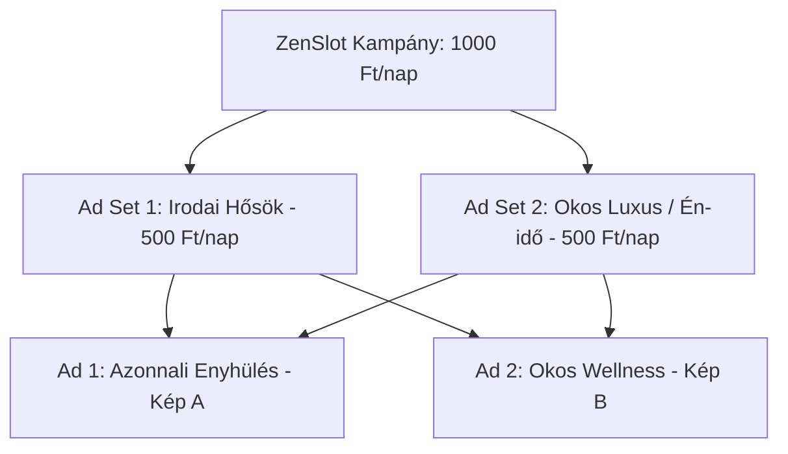

# ZenSlot Meta (Facebook & Instagram) Kampány Blueprint

Ez a dokumentum tartalmazza a **ZenSlot** első validációs kampányának teljes felépítését, hirdetéssorozatait, célcsoportjait, A/B teszt struktúráját, a pontos hirdetésszövegeket és a hozzájuk készült prémium kreatívokat.

---

## 📊 1. Kampányszintű Beállítások (Campaign Level)

*   **Kampány Célja (Objective):** Érdeklődők szerzése (Leads)
*   **Hirdetés Vásárlási Típusa (Buying Type):** Aukció (Auction)
*   **Költségkeret Típusa (Budget Strategy):** Hirdetéssorozat-költségkeret (**ABO** - Ad Set Budget). 
    *   *Miért?* Mivel A/B teszteljük a célcsoportokat, azt akarjuk, hogy a Meta algoritmusa ne vigye el a pénzt egyoldalúan, hanem mindkét célcsoport egyenlő eséllyel és kerettel induljon.
*   **Napi Költségkeret:** 1 000 Ft/nap összesen -> **500 Ft / nap / hirdetéssorozat**
*   **Időtartam:** 5 nap (összesen 5 000 Ft teljes büdzsé).
*   **Várható Megjelenítés (Impressions):** ~4 000 - 5 000 megjelenés (Budapesti wellness/szépség piacon a becsült CPM ~1 000 - 1 200 Ft).

---

## 🎯 2. Hirdetéssorozatok (Ad Sets Level - A/B Test Célcsoportok)

Két teljesen eltérő motivációjú és demográfiájú célcsoportot tesztelünk, hogy lássuk, melyik irány generál olcsóbb és elkötelezettebb feliratkozókat a "Fake Door" landing oldalon.

### 1. Hirdetéssorozat: "Irodai Hősök" (Fizikai fájdalom & stressz)
*   **Lokáció:** Budapest + 15 km sugár
*   **Életkor:** 25 - 45 év
*   **Nem:** Mindkét nem (Férfi és Nő)
*   **Részletes Célzás (Érdeklődési körök):**
    *   *Hátfájás (Back pain)*, *Masszázs (Massage)*, *Fizioterápia (Physical therapy)*, *Stressz (Stress)*, *Jóga (Yoga)*.
    *   **ÉS** szűkítve a következő munkakörökkel/érdeklődéssel (irodai ülőmunka): *Szoftverfejlesztés, Projektmenedzsment, Marketing, Könyvelés, Ügyfélszolgálat, Office worker*.
*   **Optimalizálási Esemény:** Pixel / Lead (Supabase feliratkozás trigger)
*   **Elhelyezések:** Advantage+ elhelyezések (automatikus)

### 2. Hirdetéssorozat: "Okos Luxus" (Self-care, kényeztetés & impulzivitás)
*   **Lokáció:** Budapest + 15 km sugár
*   **Életkor:** 25 - 45 év
*   **Nem:** Mindkét nem (Női fókusszal)
*   **Részletes Célzás (Érdeklődési körök):**
    *   *Luxuscikkek (Luxury goods)*, *Day spa*, *Szépségszalon (Beauty salons)*, *Bőrápolás (Skin care)*, *Aromaterápia (Aromatherapy)*, *Kikapcsolódás (Relaxation)*.
*   **Optimalizálási Esemény:** Pixel / Lead (Supabase feliratkozás trigger)
*   **Elhelyezések:** Advantage+ elhelyezések (automatikus)

---

## 🎬 3. Hirdetések Szintje (Ads Level - Kreatívok & Copy)

Mindkét hirdetéssorozatban az alábbi két hirdetés fut párhuzamosan (így mérjük a kreatívok hatékonyságát is).

### 🟢 1. Hirdetés (Ad 1): "Azonnali Enyhülés" (Relaxációs Fókusz)
*   **Kreatív neve:** `ad_creative_massage_relax.png`
*   **Vizuális stílus:** Gyönyörű, megnyugtató, prémium spa hangulatú fotó egy masszázsban relaxáló emberről, lágy meleg fényekkel és natúr földszínekkel.
*   **Hirdetés Szövegei (Copy):**

> **Főszöveg (Primary Text):**
> Hátfájás gyötör az irodai székben? Vagy csak magad mögött hagynád a hétköznapi stresszt? 🌿
> 
> Felejtsd el a hetekkel előre tervezést és a frusztráló telefonálgatást. A **ZenSlot** segítségével Budapest legjobb prémium masszázsszalonjainak váratlanul felszabadult, mai és holnapi szabad helyeit foglalhatod le – ráadásul kedvező, utolsó pillanatos árakon.
> 
> 💆‍♂️ 60 perces svédmasszázs: 15.000 Ft helyett **csak 10.500 Ft mára!**
> 
> Kattints, keresd meg a legközelebbi szabad ágyat, és relaxálj még ma este! ⬇️

*   **Címsor (Headline):** Masszázs még mára? -30% üresedési áron
*   **Leírás (Description):** Budapest prémium szalonjaiban. Foglalj 3 másodperc alatt!
*   **CTA Gomb:** Foglalás most (Book Now) vagy Keresés most (Search Now)

---

### 🟢 2. Hirdetés (Ad 2): "Okos Wellness Kényeztetés" (Minimalista Spa Vibe)
*   **Kreatív neve:** `ad_creative_spa_flatlay.png`
*   **Vizuális stílus:** Letisztult, ultra-prémium spa csendélet (esszenciális olajok, fehér törölköző, jázmin virágok és fa elemek), rengeteg szellős hellyel a prémium hangulatért.
*   **Hirdetés Szövegei (Copy):**

> **Főszöveg (Primary Text):**
> Megérdemelsz egy kis én-időt. De miért kellene heteket várnod egy szabad időpontra? ✨
> 
> A **ZenSlot** az okos wellness piactér: valós időben megmutatjuk neked a közeledben lévő, 4.8+ csillagos prémium szalonok azonnal foglalható mai és holnapi szabad slotjait.
> 
> 🌸 Nincs telefonálgatás. Nincs szervezési stressz. Csak tiszta relaxáció, amikor a leginkább szükséged van rá.
> 
> Csapj le az utolsó mai szabad helyekre! ⬇️

*   **Címsor (Headline):** ZenSlot - Prémium spa helyek mára és holnapra
*   **Leírás (Description):** Valós idejű szabad helyek a közeledben.
*   **CTA Gomb:** Keresés most (Search Now)

---

## 📈 4. Várható Metrikák & Optimalizálási Irányelvek (KPIs)

*   **Tervezett CPM:** ~1 000 - 1 200 Ft (Budapest prémium szegmensben).
*   **Várható elérés a 5 000 Ft keretből:** ~4 000 - 4 500 megjelenés.
*   **Cél CTR (Átkattintási arány):** > 2% (Ez kb. 80-90 értékes webhelylátogatót jelent).
*   **Cél CVR (Landing konverzió):** > 6% (Ebből a teszt végére **5 - 8 valós feliratkozó / Lead** várható a zárt bétára).
*   **Cél CPA (Lead-enkénti költség):** < 800 Ft.

### Napi riport és döntési szabályok a 5 napos teszt alatt:
1.  **24 óra után:** Ha valamelyik kreatív CTR-je 0.8% alatt van, azt leállítjuk, és a keretet a jobban futó kreatívra helyezzük át a hirdetéssorozaton belül.
2.  **3 nap után:** Ha a "Fake Door" landing oldalon beérkeznek az első leadek, ellenőrizzük a Supabase adatbázist, hogy a kiválasztott kezelések (svédmasszázs vs. thai) és az aromaterápiás upsell aránya hogyan alakul.
3.  **5 nap után (Kampány vége):** Kiértékeljük a két célcsoport (Irodai dolgozók vs. Luxus én-idő) közötti CPA (Lead költség) különbséget, és eldöntjük, hogy melyik irányban indítjuk el a tényleges értékesítési és partner-szervezési fázist.
