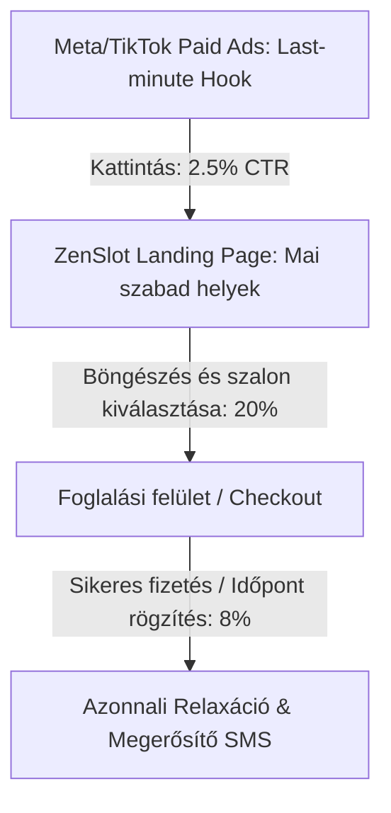
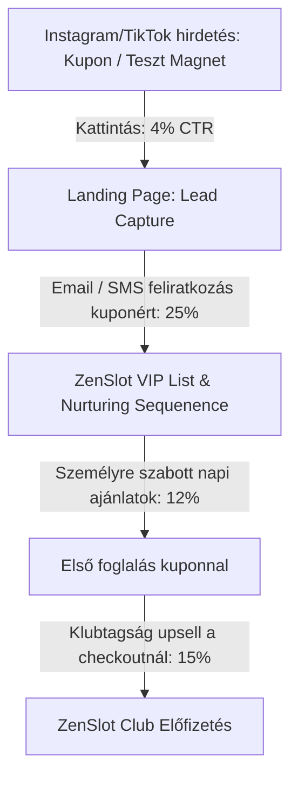

# ZenSlot Marketing and Sales Cheatsheet

## 🎯 1. POZICIONÁLÁS & STRATÉGIA

*Mielőtt bármit csinálsz, tisztázd ki vagy és kinek*

### Pozicionálás Framework (ZenSlot)

1. **Kívánt pozíció meghatározása**: 
   A ZenSlot az "Okos Luxus és Azonnali Megkönnyebbülés" szimbóluma. Nem egy olcsó kuponos oldal vagyunk, hanem egy prémium, kényelmes és villámgyors piactér, ami összeköti a stresszes, minőségi szolgáltatásra vágyó városi embereket a legjobb helyi szalonok utolsó pillanatos szabad helyeivel.
2. **Stratégia készítése**:
   - **B2C oldal**: Azonnali stressz- és fájdalomcsillapítás kommunikációja ("Masszázs még mára"). A kényelmet és az "üresedési árak" miatti okos spórolást helyezzük előtérbe.
   - **B2B oldal**: Passzív bevételnövelés a szalonoknak. Az üresen maradó, elpazarolt órák monetizálása extra marketingmunka nélkül.
3. **Üzenet stratégia**:
   "Ne várj heteket a relaxációra. Prémium masszázsok ma és holnap a közeledben, kedvező áron, egyetlen kattintással. Zen másodpercek alatt."
4. **Üzenet telepítése**:
   - Konzisztens, letisztult, spa-hangulatú arculat (földszínek, zöldek, arany, lótusz logó).
   - A landing page-en és a hirdetésekben is az azonnali elérhetőség és a prémium minőség dominál.
   - B2B partnereknél elegáns "ZenSlot Partner" matrica az ajtón és a recepción.
5. **Ismétlés**:
   Minden hirdetés, email és SMS ugyanazt az üzenetet erősíti: a stresszoldás nem tervezést, hanem elhatározást igényel.
6. **Észlelt pozíció befolyásolása**:
   A felhasználói visszajelzések alapján folyamatosan kiemeljük a szalonok szigorú minőségi szűrését és a foglalás 3 másodperces egyszerűségét (nincs telefonálgatás).

---

### Értékajánlat Canvas (B2C Felhasználó)

**Customer Jobs-to-be-Done:**
- Gyors és hatékony stresszoldás, hát- és nyakfájás kezelése egy nehéz munkanap után.
- Időpont-egyeztetés nélküli, azonnali, rugalmas foglalás (pl. "most van egy szabad órám, elmennék masszázsra").
- Utolsó pillanatos, magas észlelt értékű élményajándék vásárlása magának vagy párjának.

**Fájdalmak (Pains):**
- A kedvenc vagy minőségi masszázsszalonokba 2-3 hét a várakozási idő.
- A telefonálgatás, üzenetváltás és egyeztetés fárasztó, időigényes és frusztráló.
- A prémium masszázsok teljes ára magas, nehezen illeszthető be a heti költségvetésbe.
- A bizonytalan minőségű szalonoktól való félelem (zsákbamacska).

**Nyereségek (Gains):**
- Fizikai és mentális megkönnyebbülés *még ma*, amikor a legnagyobb szükség van rá.
- Időmegtakarítás: nincs telefonálás, a ZenSlot valós időben mutatja a szabad ágyakat.
- Pénzügyi elégedettség: prémium szolgáltatás igénybevétele kedvezőbb "üresedési" áron.
- Új, megbízható luxus wellness helyek felfedezése rizikó nélkül.

---

### Value Equation (Értékegyenlet - Alex Hormozi alapján)

1. **Álom eredmény (Dream Outcome) - 95/100**:
   Azonnali testi-lelki újjászületés, a kínzó hátfájás megszűnése és mély relaxáció egy prémium környezetben, kompromisszumok nélkül.
2. **Megvalósíthatóság (Likelihood of Achievement) - 90/100**:
   Kizárólag ellenőrzött, 4.8+ csillagos értékelésű szalonokat engedünk a platformra, így a prémium élmény garantált.
3. **Időbeli késleltetés (Time Delay) - 0.05/1**:
   Gyakorlatilag nulla. A foglalástól számítva akár 1-2 órán belül már a masszázságyon fekszik a vendég.
4. **Befektetett erőfeszítés (Effort & Sacrifice) - 0.1/1**:
   Minimális. Nincs telefonálgatás, nincs e-mailezés. 3 kattintás a telefonon, és a hely le van foglalva.

**Offer Score kiszámítása:**
$$\text{Offer Score} = \frac{\text{Dream (95)} \times \text{Achievement (90)}}{\text{Time (0.05)} \times \text{Effort (0.1)}} = \frac{8550}{0.005} = 1,710,000$$
*Ez egy rendkívül erős, szinte ellenállhatatlan ajánlatérték, mivel az azonnali kézzelfogható eredményt (idő) minimális kényelmetlenséggel (erőfeszítés) nyújtja.*

---

## 🧲 2. ÉRDEKLŐDÉS FELKELTÉSE (ACQUISITION)

*Hogyan szerezz új érdeklődőket*

### Paid Ads Stratégia (Meta & TikTok)

**15 Scroll-Stopping HOOK ötlet:**
1. "Hátfájás gyötör az irodai székben? Ne várd meg a jövő hetet..."
2. "Tudtad, hogy a budapesti masszázsszalonok időpontjainak 23%-a ma is üresen marad?"
3. "Ma este relaxálnál? Mutatjuk, hol van még szabad ágy a közeledben!"
4. "Ez a trükk megmenti a nyakadat egy 8 órás monitor előtt töltött nap után."
5. "Hogyan kaphatsz 5-csillagos svédmasszázst ma, üresedési áron?"
6. "Ha most azonnal be tudnál feküdni egy relaxáló masszázsra, megtennéd?"
7. "Stresszes napod volt? A ZenSlot-tal még ma este kikapcsolódhatsz."
8. "A luxusszalonok féltett titka: Miért olcsóbb az utolsó pillanatos foglalás?"
9. "3 dolog, ami azonnal csökkenti a kortizolszintedet egy kemény munkanap után."
10. "Ne telefonálj többet! A ZenSlot megmutatja a mai szabad helyeket."
11. "Mindig foglalt a kedvenc szalonod? Íme az okos kiskapu."
12. "Azonnali relaxáció luxus kivitelben – ma este, a szomszédban."
13. "Így mentettem meg a mai napomat 60 perc alatt – stresszmentesen."
14. "Ha ezt a videót látod, még van szabad ZenSlot időpont ma a kerületedben!"
15. "Felejtsd el a hetekkel előre tervezést. Élj a pillanatnak a ZenSlot-tal."

**4 Meat forgatókönyv a meggyőzéshez:**
1. **Több jó dolog (ha cselekszel)**:
   "Ha ma foglalsz a ZenSlot-tal, egy órán belül már egy prémium szalon illatos masszázságyán fekszel. A feszültség elpárolog a vállaidból, az elméd elcsendesedik, és estére teljesen feltöltődve, energikusan térsz haza."
2. **Kevesebb rossz dolog (ha cselekszel)**:
   "A ZenSlot segítségével elfelejtheted a frusztráló telefonálgatást és a 'sajnos ezen a héten már tele vagyunk' válaszokat. Nincs többé halogatott hátfájás vagy feszült hétvége."
3. **Több rossz dolog (ha NEM cselekszel)**:
   "Ha ma is csak legyintesz a hátfájásra, a feszültség holnapra még rosszabb lesz. A nyakad teljesen beáll, a stressz rányomja a bélyegét a hangulatodra, és hetekig kell tűrnöd, mire végre eljutsz egy masszőrhöz."
4. **Kevesebb jó dolog (ha NEM cselekszel)**:
   "Ha kihagyod a ZenSlot mai szabad helyeit, lemaradsz arról az azonnali, prémium kényeztetésről és megkönnyebbülésről, amit ma este a szokásos ár töredékéért kaphatnál meg."

**5 CTA alternatíva:**
- "Nézd meg a mai szabad helyeket!"
- "Foglalj prémium masszázst mára!"
- "Kattints a szabad ágyakért!"
- "Csapj le egy ma esti üresedésre!"
- "ZenSlot: Relaxáció most!"

---

### Lead Magnetek (B2C & B2B)

1. **Azonnali 3000 Ft-os kupon** az első utolsó pillanatos foglalásra (valós pénzügyi érték).
2. **"Irodai Nyújtás és Tartásjavítás" 5 napos mini-videósorozat** (egyszerű gyakorlatok az íróasztalnál a hátfájás megelőzésére).
3. **Személyre szabott Stressz- és Masszázs-típus Teszt** (Interaktív kérdőív, ami megmutatja, milyen típusú kezelésre van leginkább szüksége a testének).
4. **B2B szalonoknak**: Ingyenes "Üresedési és Kapacitás-kihasználtság kalkulátor" (megmutatja, pontosan mennyi bevételt veszítenek havonta az üres órákon, és hogyan mentheti ezt meg a ZenSlot).
5. **Last-Minute VIP Értesítési Csatorna**: Feliratkozás azonnali SMS/Viber értesítésekre, ha a környékükön lévő prémium szalonokban 50%-os villámáras hely szabadul fel.
6. **Prémium "Otthoni Spa és Relaxációs" e-könyv** (aromaterápiás tippek, zenei lejátszási listák és önmasszázs technikák).

---

### Content Marketing (MTH Stratégia - Mítosz, Tévhit, Hiba)

1. **Mítosz: "A jó masszőrhöz hetekkel előre be kell jelentkezni."**
   *Valóság*: Még a legnépszerűbb prémium szalonokban is történnek lemondások vagy váratlan üresedések az utolsó 24 órában. A ZenSlot pontosan ezeket a rejtett gyöngyszemeket teszi láthatóvá és azonnal foglalhatóvá számodra.
2. **Tévhit: "Az olcsóbb, last-minute masszázs gyengébb minőségű."**
   *Valóság*: Ugyanaz az okleveles, magasan képzett szakember végez el, ugyanabban a luxus szalonban. A kedvezmény kizárólag azért van, mert a szalonnak jobb egy csökkentett árú foglalás, mint egy teljesen üresen álló óra.
3. **Hiba: "Megvárni, amíg a hátfájás teljesen elviselhetetlenné válik."**
   *Valóság*: A krónikus feszültség kezelése sokkal nehezebb. A rendszeres prevenció a ZenSlot-tal rugalmasan, tervezés nélkül és rendkívül pénztárcabarát módon beépíthető a mindennapokba.
4. **Tévhit: "A telefonos egyeztetés a legbiztosabb módja a foglalásnak."**
   *Valóság*: A masszőrök munka közben nem veszik fel a telefont, az üzengetés pedig órákig tarthat. A ZenSlot valós idejű naptár-integrációja 100%-os garanciát nyújt azonnal.
5. **Mítosz: "A masszázs csak luxus kényeztetés, nem egészségügyi szükséglet."**
   *Valóság*: A stressz fizikai tüneteket, izomcsomókat és alvászavart okoz. A 60 perces mentális és fizikai kikapcsolódás a leghatékonyabb produktivitás-növelő.
6. **Hiba: "Kuponos oldalakon vadászni az olcsó masszázsokra."**
   *Valóság*: A kuponos helyek gyakran túlterheltek és alacsonyabb minőségűek. A ZenSlot kizárólag szűrt, prémium szalonokkal dolgozik, ahol a minőség az első.
7. **Tévhit: "Nincs időm elmenni masszázsra hét közben."**
   *Valóság*: A ZenSlot-tal pont akkor foglalhatsz, amikor váratlanul felszabadul egy órád (pl. elmarad egy megbeszélés). Nem kell napokkal előre kalkulálnod.
8. **Mítosz: "Minden masszázs egyforma."**
   *Valóság*: A svéd, a mélyszöveti, a thai vagy az aromaterápiás masszázs teljesen más problémára jó. A platformunk segít kiválasztani a számodra tökéletes kezelést.
9. **Hiba: "Azt hinni, hogy a relaxációhoz el kell utazni egy wellness hétvégére."**
   *Valóság*: 60 perc egy közeli prémium szalonban ugyanazt a mentális resetet képes nyújtani a hétköznapok közepén, utazási költségek nélkül.
10. **Tévhit: "A last-minute foglalás stresszes és bizonytalan."**
    *Valóság*: A ZenSlot felületén a foglalás, fizetés és a szalonba navigálás egyetlen zökkenőmentes folyamat, ami azonnal megnyugtatja a felhasználót.

---

### Sales Funnel Alternatívák

#### 1. Funnel A: Azonnali "Villám-Foglalás" Funnel (Rövid távú konverzió)

*Várható átlagos konverziós ráta a landing oldalon: 6-8%*

#### 2. Funnel B: "Okos Wellness Club" Funnel (Hosszú távú érték növelés)

*Várható átlagos konverziós ráta az adatbázisból: 12-15%*

---

## 🎬 3. AKTIVÁLÁS & ÉRTÉKESÍTÉS

*Hogyan alakítsd az érdeklődőket fizetős ügyfelekké*

### Video Sales Letter (VSL) Struktúra (3 alternatíva)

#### Alternatíva 1: "Az Irodai Hős" (Hátfájás és stressz fókuszú)
- **Proof**: Statisztika: Az ülőmunkát végzők 82%-a szenved rendszeres hátfájástól. Mutatunk egy 5-csillagos budapesti szalont, ahol ma este 3 szabad ágy várja a megkönnyebbülést keresőket.
- **Promise**: Megmutatjuk, hogyan szabadulhatsz meg a nyaki feszültségtől még ma este, anélkül, hogy heteket várnál egy szabad időpontra vagy vagyonokat költenél.
- **Pain**: Egész nap a gép előtt ülsz, a vállaid beálltak, a fejed zúg a stressztől. Felhívnád a szalont, de tudod, hogy hetekre előre tele vannak.
- **Plan**: A ZenSlot valós időben összegyűjti a közeledben lévő top szalonok mai üresedéseit, és exkluzív üresedési áron adja oda neked, 3 kattintással.
- **Picture**: Képzeld el, hogy ma 6 órakor felállsz az asztaltól, és 6:15-kor már egy halk, illatos szalonban relaxálsz, miközben a feszültség teljesen eltűnik a testedből. Holnap reggel új emberként ébredsz.
- **Sikertörténet**: *Péter (34, szoftverfejlesztő)*: "A ZenSlot mentette meg a hátamat. Csütörtök délután éreztem, hogy teljesen beállt a nyakam. Ránéztem az oldalra, találtam egy szabad helyet 18:30-ra a szomszéd utcában. Zseniális, gyors és profi volt!"

#### Alternatíva 2: "Az Okos Luxus" (Rohanó nők és impulzív kényeztetés)
- **Proof**: Több száz elégedett nő, aki a ZenSlot-ot használja a heti "én-idő" megszervezésére. Gyönyörű spa belsők és prémium olajok bemutatása.
- **Promise**: Prémium wellness és kényeztetés ma este, kompromisszumok nélkül – okos áron, szervezési hercehurca nélkül.
- **Pain**: Szeretnél egy kis kényeztetést, de a rohanó hétköznapokban képtelenség 2 héttel előre fix időpontot lefoglalni. Ha mégis ráérnél, minden szalon zárva van vagy foglalt.
- **Plan**: A ZenSlot megmutatja a ma szabadon maradt luxus slotokat. A szalonok örülnek, hogy nem üres a szoba, te pedig élvezheted a prémium minőséget kedvezőbb áron.
- **Picture**: Azonnali kikapcsolódás, amikor csak szükséged van rá. Forró tea, lágy zene, illatos olajok – a saját feltételeid szerint, stresszmentesen.
- **Sikertörténet**: *Kinga (29, marketing vezető)*: "Imádom a luxust, de utálok tervezni. A ZenSlot-tal akkor megyek masszázsra, amikor a naptáram hirtelen engedi. Sosem csalódtam még a szalonokban!"

#### Alternatíva 3: "A Megmentett Ajándék" (Utolsó pillanatos élményajándék)
- **Proof**: Hálás párok és ünnepeltek visszajelzései, akik egy felejthetetlen közös masszázs élménnyel gazdagodtak.
- **Promise**: A tökéletes, prémium élményajándék vagy közös program még mára vagy holnapra – pánikmentesen.
- **Pain**: Elfelejtetted a szülinapot, évfordulót, vagy csak szeretnéd meglepni a párodat ma este valami igazán különlegessel, de minden ötlet elcsépelt és a jó helyek telve vannak.
- **Plan**: Foglalj egy páros masszázst a ZenSlot utolsó pillanatos luxus ajánlatai közül azonnal.
- **Picture**: Az utolsó pillanatos stresszből egy csodálatos, romantikus közös élmény kerekedik, amiért a párod örökké hálás lesz neveg.
- **Sikertörténet**: *Tamás (42, vállalkozó)*: "Elfelejtettem az évfordulónkat a rohanásban. Péntek délben vettem észre. A ZenSlot segítségével sikerült lefoglalnom egy ma esti páros aromaterápiás masszázst egy gyönyörű belvárosi szalonban. A feleségem el volt ragadtatva!"

---

### Ellenvetések Kezelése - 3A Framework (B2C)

1. **"Biztosan a legrosszabb szalonok vannak fent a platformon, akiknek nincs vendégük."**
   - *Acknowledge*: "Teljesen megértem ezt a félelmet, én is gyanakodnék, ha egy oldalon folyamatosan üres helyeket látnék."
   - *Associate*: "Érdekes módon a legtöbb új ügyfelünk pontosan így gondolta, mielőtt kipróbált minket."
   - *Ask*: "Tudtad, hogy kizárólag olyan szalonokkal dolgozunk, amelyek rendelkeznek 4.8+ Google értékeléssel, és az üresedések náluk is a váratlan, utolsó pillanatos lemondásokból adódnak? Mit szólnál, ha megnéznénk a közeledben lévő, általad is ismert prémium helyek listáját?"

2. **"Túl drága nekem a prémium masszázs."**
   - *Acknowledge*: "Abszolút fair szempont, a minőségi wellness szolgáltatások ára valóban jelentős tétel lehet."
   - *Associate*: "A legtöbb ügyfelünk korábban sokallta a prémium szalonok árait, és inkább az olcsóbb, de bizonytalan minőségű helyeket választotta."
   - *Ask*: "Mi lenne, ha azt mondanám, hogy a ZenSlot-tal pont a magas minőségű luxust kapod meg, de az üresedési kedvezmények miatt akár 30-40%-kal olcsóbban, mint a normál ár? Így nem a minőségen kell spórolnod. Megérne egy próbát a hátad egészsége?"

3. **"Mi van, ha le kell mondanom az időpontot az utolsó pillanatban?"**
   - *Acknowledge*: "Nagyon jó kérdés, hiszen a rohanó hétköznapokban bármi közbejöhet."
   - *Associate*: "Sok rohanó üzletember ügyfelünk is aggódott ezen, mert a naptáruk percről percre változik."
   - *Ask*: "Mivel ezek utolsó pillanatos helyek, a szalonoknak kritikus az időpont, de mi biztosítunk egy rugalmas 'Mégsem érkezem' gombot a foglalás előtt 2 óráig, amivel ingyenesen átütemezheted a foglalásod. Ez így megnyugtató számodra?"

4. **"Nem akarok regisztrálni és egy újabb alkalmazást letölteni."**
   - *Acknowledge*: "Teljesen megértem, nekem is tele van a telefonom felesleges appokkal."
   - *Associate*: "A felhasználóink 90%-a ugyanezt mondta, mert utálják a bonyolult folyamatokat."
   - *Ask*: "Tudtad, hogy a ZenSlot használatához nem kell semmit letöltened? A webes felületünkön regisztráció nélkül, közvetlenül a böngészőből, Google vagy Apple fiókkal 30 másodperc alatt befejezheted a foglalást. Kipróbáljuk, milyen gyors?"

5. **"Egyszerűen nincs időm masszázsra járni hét közben."**
   - *Acknowledge*: "Abszolút, az idő a legértékesebb kincsünk, mindannyian időhiánnyal küzdünk."
   - *Associate*: "A legelfoglaltabb menedzser ügyfeleink is pont ezzel küzdöttek korábban."
   - *Ask*: "Éppen ezért fejlesztettük ki a ZenSlotot: nem kell hetekkel előre tervezned és szabaddá tenned magad. Ha felszabadul egy órád két tárgyalás között, csak megnyitod az oldalt, és lefoglalod a szomszéd utcában lévő mai helyet. Így az időhiány nem akadály, hanem lehetőség. Mit gondolsz, ez beleférne a rugalmas napodba?"

6. **"Félek az idegen masszőröktől és szalonoktól."**
   - *Acknowledge*: "Ez teljesen természetes, a masszázs egy nagyon személyes, bizalmi szolgáltatás."
   - *Associate*: "A legtöbb női vendégünk nagyon óvatos volt az első alkalommal az ismeretlen helyekkel kapcsolatban."
   - *Ask*: "Tudtad, hogy a ZenSlot-on minden szalonról részletes fotókat, hitelesített vendégértékeléseket és a masszőrök profilját is láthatod a foglalás előtt? Így pontosan tudod, kihez és hova mész. Van esetleg konkrét szalontípus vagy masszázsfajta, amivel biztonságosabban éreznéd magad?"

7. **"Tényleg valósak az 'üresedési kedvezmények', vagy ez csak marketing?"**
   - *Acknowledge*: "Nagyon jogos a szkepticizmusod, a mai világban rengeteg a hamis akciós ajánlat."
   - *Associate*: "Az első felhasználóink is gyanakodtak, hogy ez csak egy újabb 'áremelés utáni leértékelés' trükk."
   - *Ask*: "Bármikor összehasonlíthatod a ZenSlot árait a szalonok saját, hivatalos árlistájával a weboldalukon – garantáljuk, hogy a mi árunk legalább 20-40%-kal alacsonyabb az adott utolsó pillanatos slotra. Mi lenne, ha most azonnal leellenőriznénk az egyik kedvenc helyedet?"

8. **"Nem hiszem, hogy egy 60 perces masszázs megoldja a krónikus stresszemet."**
   - *Acknowledge*: "Teljesen igazad van, a krónikus stresszt nem lehet egy csapásra eltüntetni."
   - *Associate*: "A kiégéssel küzdő vállalkozó ügyfeleink is pontosan így éreztek az elején."
   - *Ask*: "Egyetlen masszázs nem csodaszer, de bizonyítottan csökkenti a fizikai feszültséget és a kortizolszintet azonnal, ami elindítja a regenerációt. Mi lenne, ha nem egyetlen alkalomként tekintenél rá, hanem egy könnyen elérhető, heti 'mentális újraindításként'? Megérdemel a tested egy órát a héten?"

9. **"Messze vannak tőlem a jó szalonok."**
   - *Acknowledge*: "Érthető, senki sem akar egy masszázs után még egy órát utazni a dugóban hazafelé."
   - *Associate*: "Az agglomerációban élő vagy külvárosi ügyfeleink is emiatt aggódtak a leginkább."
   - *Ask*: "A ZenSlot beépített térképes keresője pontosan méter alapján mutatja a legközelebbi szabad helyeket a tartózkodási helyedhez képest. Biztos vagy benne, hogy nincs egy rejtett, prémium szalon 5 percre az irodádtól vagy az otthonodtól? Megnézzük a térképen?"

10. **"Inkább megvárom a megszokott masszőrömet, még ha hetek múlva is ér rá."**
    - *Acknowledge*: "A megszokott, jó szakember aranyat ér, teljesen megértem a hűségedet."
    - *Associate*: "A hűséges vendégeink is nehezen váltottak először más masszőrre."
    - *Ask*: "Mi van akkor, ha a hátad ma fáj, a megszokott masszőröd pedig csak 3 hét múlva ér rá? Miért kellene szenvedned addig? A ZenSlot segít áthidalni ezt az időszakot azzal, hogy garantáltan szűrt, ugyanolyan profi alternatívát kínál azonnal. Megéri kockáztatni a köztes hetekben a feszültséget, ha ma is kaphatsz segítséget?"

---

## 🎁 4. PÉNZÜGYI MODELL (4-RÉSZES AJÁNLAT)

*Maximalizáld a bevételt minden ügyfélből a ZenSlot-nál*

### 1. Vonzási Ajánlat (Front-End / Hook)
- **Ajánlat**: "Kényeztetés másodpercek alatt – Első prémium masszázsod ma este -25% kedvezménnyel!" vagy "3000 Ft értékű ajándékkupon az első azonnali foglalásodhoz."
- **Cél**: A bizalom kiépítése, a fizetési adatok megadása, a platform egyszerűségének megtapasztalása.

### 2. Upsell Ajánlat (Deepen)
- **Ajánlat**: A foglalási folyamat során (a checkout előtt):
  - **Aromaterápiás Upgrade**: "Kérd a masszázsodat prémium organikus levendula/kókusz bio olajjal mindössze +1500 Ft-ért!"
  - **Idő Upgrade**: "Nyújtsd meg a relaxációt: +15 perc extra arcmasszázs vagy talpmasszázs csak +2900 Ft-ért."
  - **Páros Upgrade**: "Hozd magaddal a párodat is! A második főnek ma +35% kedvezmény."

### 3. Downsell Ajánlat (Rugalmas Alternatíva)
- **Ajánlat**: Ha a látogató el akarja hagyni a checkout oldalt fizetés nélkül:
  - "Nincs ideje egy teljes órára? Foglaljon egy expressz 30 perces frissítő hátmasszázst ma csak 7900 Ft-ért!"
  - Vagy: "Iratkozzon fel a mai ingyenes VIP SMS értesítőre a kerületében felszabaduló 50%-os szuper-ajánlatokért."

### 4. Kontinuitás Ajánlat (Recurring Revenue)
- **Ajánlat**: **"ZenSlot VIP Club"** tagság.
  - **Díj**: Havi 4900 Ft.
  - **Előnyök**:
    - Fix 15% extra kedvezmény *minden* utolsó pillanatos foglalásból.
    - Korai hozzáférés: 2 órával a nagyközönség előtt látják a frissen felszabadult mai helyeket.
    - Ingyenes lemondási/módosítási garancia a kezdés előtt 1 óráig.
    - Havi 1 ingyenes aroma-upgrade ajándék.

---

### Árazási Pszichológia Alkalmazása

- **"Pennies-a-Day" Technika**:
  - "A ZenSlot VIP Club tagság **mindössze napi 160 Ft** (kevesebb, mint egy negyed Starbucks kávé ára). Ennyiért garantálod magadnak az azonnali, fájdalommentes és stresszmentes hétköznapokat egész hónapban."
- **Anchor Pricing (Horgony árazás)**:
  - A szalon eredeti ára (pl. 22.000 Ft) markánsan át van húzva, mellette kiemelve a ZenSlot utolsó pillanatos ára (pl. 14.900 Ft), alatta pedig a VIP Club tagoknak járó ár (12.660 Ft). Ez vizuálisan azonnal megmutatja az óriási megtakarított értéket.

---

### Éves Megújítási Díj Trükk
A VIP Club havi előfizetése mellé bevezetünk egy minimális **"Rendszer-karbantartási és Szalon-biztosítási Díjat"** (évente egyszer 7900 Ft).
- *Kommunikáció*: "Ez a díj garantálja, hogy a szalonok azonnali kárpótlást kapnak lemondás esetén, te pedig 100%-os elégedettségi garanciát élvezhetsz."
- *Hatás*: Ez azonnal 10-15%-kal növeli a platform nettó profitabilitását, miközben az ügyfelek elfogadják a garancia értékét.

---

## 📧 5. KÖVETÉS & NURTURING

*Tartsd melegen a kapcsolatot a ZenSlot felhasználókkal*

### 3-7-30 Módszer (B2C Automatikus Email / SMS szekvencia)

#### Első 3 nap (Azonnali elköteleződés):
1. **1. nap: A legjobb esettanulmány (és üdvözlés)**
   - *Tárgy*: Szia [Név], üdvözöl a stresszmentes zóna! 🌿
   - *Tartalom*: Köszöntés + Péter szoftverfejlesztő története, aki heti 3 napot szenvedett hátfájástól, míg a ZenSlot-tal talált egy gyors ma esti masszázst a munkahelye mellett.
2. **2. nap: A legjobb ügyfél-átalakulás (Vizuális meggyőzés)**
   - *Tárgy*: Agyonhajszoltból kisimult – Így csinálta Kinga 60 perc alatt.
   - *Tartalom*: Előtte-utána hangulatbemutató. Hogyan segít a masszázs a kortizolszint csökkentésében és a jobb alvásban.
3. **3. nap: A legnagyobb iparági insight (Okos Luxus)**
   - *Tárgy*: Miért marad üresen a budapesti masszázságyak 23%-a? (És hogyan spórolsz ezen te)
   - *Tartalom*: A last-minute gazdaságtan elmagyarázása. Miért win-win ez a szalonnak és neked.

#### Következő 7 nap (Félelmek és ellenvetések lebontása minden 2. napon):
- **5. nap: Minőségi aggályok kezelése**
  - *Tárgy*: Hogyan szűrjük ki a szalonokat? (Csak a 4.8+ csillagosok maradhatnak)
- **7. nap: Időhiány kezelése**
  - *Tárgy*: Nincs időd tervezni? Nem is kell. A 3-kattintásos azonnali relaxáció.
- **9. nap: Ár-érték arány és okos döntések**
  - *Tárgy*: Mennyit ér meg a hátad egészsége? Kevesebb, mint gondolnád.

#### Következő 30 nap (Rendszeresség és lojalitás fenntartása kéthetente):
- **15. nap: Szezonális wellness tippek**
  - *Tárgy*: 3 jel, hogy a testednek azonnali mentális resetre van szüksége.
- **30. nap: VIP Club meghívó**
  - *Tárgy*: Így spórolhatsz havi 15.000 Ft-ot, ha rendszeresen relaxálsz.

---

### Egyszerű Email Sablonok

#### 1. Újraaktiváló Email (90+ napja inaktív felhasználóknak)
```
Tárgy: Még mindig szeretnél megszabadulni a hátfájástól és a mindennapi stressztől, [Név]?

Kedves [Név],

Pár hónapja nem láttunk a ZenSlot-on. Reméljük, a hátad és a vállaid jól bírják az irodai hajtást! 

De ha a monitor előtt ülve most is érzed azt a kellemetlen, feszülő érzést a nyakadban... van egy jó hírem.

Mára is összegyűjtöttük a környéked legjobb szalonjainak váratlanul felszabadult, prémium helyeit. 

Hogy segítsünk újra elindulni a stresszmentes úton, itt egy exkluzív VIP kuponkód, amit csak a következő 48 órában tudsz felhasználni:

👉 KUPONKÓDOD: UJRAZEN (3000 Ft kedvezmény bármelyik mai vagy holnapi masszázsra)

Ne várd meg, amíg teljesen beáll a hátad. Kattints az alábbi gombra, nézd meg a mai szabad helyeket a közeledben, és relaxálj még ma este!

[ gomb: Nézd meg a mai szabad helyeket! ]

Baráti üdvözlettel,
A ZenSlot Csapata

P.S. A kuponkód 48 óra múlva lejár, és a mai helyek száma szalononként korlátozott (általában csak 1-2 szabad slot van naponta). Ne maradj le a ma esti megkönnyebbülésről!
```

#### 2. Rendszeres Hírlevél Sablon (Heti "Azonnali Reset" Értesítő)
```
Tárgy: [Heti Reset] Stresszes hét áll mögötted? Itt a ma esti mentőöv! 💆‍♂️

Kedves [Név],

Túl vagy egy nehéz héten? Megbeszélések, határidők, folyamatos rohanás... Ismerős?

A tested ilyenkor küldi a jeleket: feszültség a vállakban, nehéz koncentráció, fáradtság. 

Tudtad, hogy egyetlen 60 perces svédmasszázs:
• 30%-kal csökkenti a stresszhormonok (kortizol) szintjét azonnal.
• Serkenti a boldogsághormonok (endorfin és szerotonin) termelődését.
• Javítja a vérkeringést, így hétvégére teljesen kisimulsz.

Nem kell hetekkel előre tervezned. Most azonnal szabad helyek várnak rád a közeledben lévő top szalonokban, fantasztikus üresedési áron.

Nincs telefonálás, nincs várakozás. Csak kattints, válassz egy neked megfelelő mai időpontot, és feküdj be a meleg masszázságyra 2 órán belül!

[ gomb: Kérem a mai azonnali relaxációt! ]

Kellemes hétvégét és jó feltöltődést kívánunk,
A ZenSlot Csapata

P.S. Ha még ma lefoglalod a helyed, a checkoutnál választhatsz egy ajándék levendulás prémium masszázsolaj-upgrade-et teljesen ingyen! 😉
```

---

## 🔄 6. MEGTARTÁS & BŐVÍTÉS

*Hogyan növeld a ZenSlot ügyfelek élettartam-értékét (LTV)*

### Első 90 Nap Lojalitási Program

#### 1-30 nap: Magas figyelem és Aktiválás
- **Üdvözlő hívás/SMS**: A foglalás után azonnal SMS a pontos címmel, parkolási információkkal és a masszőr nevével.
- **24h Onboarding Check-in**: A masszázs utáni napon automata email: "Hogy érzed magad? Kisimultak a vonalaid?" – Értékelés bekérése a szalonról és a ZenSlot felületéről.
- **Első Győzelem**: Ha értékelést ad, azonnal kap egy 15%-os kupont a következő havi "karbantartó" masszázsára.

#### 31-60 nap: Rendszeressé válás (Habit Loop)
- **Havi Wellness Összefoglaló**: Email a test egészségéről + emlékeztető, hogy az izmoknak 3-4 hetente szükségük van a feszültségoldásra.
- **VIP Tagság felajánlása**: A 2. sikeres foglalás után felajánljuk a "ZenSlot VIP Club" tagságot 1 hónap ingyenes próbaidőszakkal.

#### 61-90 nap: Rögzítés és Nagykövet státusz
- **Negyedéves egészség-audit**: Személyre szabott statisztika: "Idén már 180 percet szántál a testi-lelki egészségedre a ZenSlot-tal! Köszönjük, hogy vigyázol magadra."
- **Affiliate/Ajánlói meghívó**: A 3. foglalás után kiemelt ajánlói link küldése.

---

### Üdvözlési Ajándék Trükk (ZenSlot kiadás)
Közvetlenül a regisztráció vagy az első sikeres foglalás után a köszönőoldalon megjelenik a kérdés:
> *"Üdvözlő ajándékként szeretnél egy prémium bio levendula olajos aromaterápiás kényeztetést az első masszázsod mellé, VAGY inkább egy 15 perces frissítő arcmasszázs-upgrade-et választasz?"*

A felhasználó választ (pl. a levendula olajat). 
Azonnal felugrik a következő üzenet:
> *"Tudod mit? Fantasztikus vagy, hogy időt szánsz az egészségedre! Fogadd el tőlünk MINDKETTŐ upgrade-et teljesen ingyen az első alkalmadhoz!"*

**Miért zseniális ez?**
- A választás pillanatában a felhasználó mentálisan elköteleződik a szolgáltatás mellett.
- A meglepetésként adott plusz ajándék óriási dopaminlöketet ad, ami azonnal lojalitássá és pozitív értékeléssé alakul a szalonban.
- A szalonokkal kötött partnerség miatt ez nekünk szinte nulla extra költséggel jár, miközben a vendégnél az észlelt érték hatalmas.

---

### Affiliate / Partner Program (Win-Win-Win)

**Szintezett Jutalmazási Rendszer:**
- **"Zen Nagykövet" szint (1-5 ajánlás)**: Minden meghívott barát után 3000 Ft kupon a meghívónak, és 3000 Ft az új tagnak.
- **"Zen Guru" szint (6-15 ajánlás)**: Ingyenes 60 perces prémium masszázs + hozzáférés az exkluzív, limitált VIP szalonokhoz.
- **"Zen Mester" szint (15+ ajánlás)**: Fix havi 1 ingyenes masszázs + ZenSlot ajándékcsomag (prémium köntös, masszázsolajok, otthoni relaxációs szett).

---

## 📊 7. MÉRÉS & OPTIMALIZÁLÁS

*A ZenSlot növekedési metrikái (AARRR)*

### 1. Acquisition (Ügyfélszerzés)
- **CAC (Ügyfélszerzési költség)**: Mennyi Facebook/Meta hirdetési díjba kerül 1 új fizetős foglalót szerezni. (Cél: 4500 Ft alatt).
- **Hirdetési CTR és Landing Page konverziós ráta**: Cél: CTR > 2%, Landing Page conversion (feliratkozás/foglalás indítás) > 10%.

### 2. Activation (Aktiválás)
- **TTV (Time to Value)**: Mennyi idő telik el a landing oldal megnyitása és az első sikeres foglalás között. (Cél: 5 percen belül).
- **Onboarding completion**: Hányan fejezik be a checkout folyamatot a fizetési adatok megadása után. (Cél: > 75%).

### 3. Retention (Megtartás)
- **Havi Churn ráta**: A VIP Club tagok hány százaléka mondja le a tagságát havonta. (Cél: < 5%).
- **Ismétlési ráta (Cohort)**: Az első foglalók hány százaléka foglal újra 45 napon belül. (Cél: > 35%).

### 4. Revenue (Bevétel)
- **LTV (Lifetime Value)**: Egy felhasználó által generált teljes közvetített jutalékbevétel a platformon. (Cél: legalább a CAC 3x-osa).
- **AOV (Átlagos Foglalási Érték)**: A kosárérték növekedése az upsell és upgrade ajánlatok segítségével. (Cél: 18.500 Ft felett).

### 5. Referral (Ajánlás)
- **Vírus-koefficiens ($K$-faktor)**: Hány új felhasználót hoz be átlagosan egy meglévő aktív felhasználó az ajánlói kóddal. (Cél: > 0.15).
- **NPS (Net Promoter Score)**: A masszázs után kiküldött elégedettségi kérdőív alapján. (Cél: > 75).

---

## 🚀 8. GYORS NYERÉSEK & TIPPEK

*Azonnal implementálható taktikák a ZenSlot indulásához*

### 1. Saját márka védelme (Brand search ads)
Vásárolj célzott Google hirdetést a "ZenSlot" és "Zen Slot masszázs" kulcsszavakra. Mivel a landing oldalad organic pozíciója még új, ne engedd, hogy esetleges versenytársak lehalásszák a rád keresőket.

### 2. Azonnali B2B Voicemail & SMS trükk
Kérd meg a csatlakozott szalonokat, hogy ha munka közben nem tudják felvenni a telefont, az automata SMS/Voicemail válaszuk ez legyen:
> *"Szia! Jelenleg épp masszírozok, így nem tudom felvenni a telefont. Ha azonnal szabad időpontot keresel mára vagy holnapra nálunk, látogass el a zenslot.hu oldalra, ahol valós időben foglalhatsz és azonnali kedvezményt kapsz!"*

*Eredmény*: A szalon hívásait közvetlenül a te platformodra tereli, azonnali konverziót generálva neked jutalékkal!

### 3. Dinamikus Hétvégi és Csúcsidő Árazás
Vezess be automatikus, időalapú árazást:
- **Hétköznap délelőtt (10:00-14:00)**: Extra "Happy Hour" kedvezmény (-10%), hogy feltöltsd a legnehezebben eladható órákat.
- **Péntek délután és Hétvége (16:00-21:00)**: Prémium felár (+15%), mivel ilyenkor a legmagasabb a fizetési hajlandóság és a kereslet a masszázsra.

### 4. Véleménygeneráló Ajándék Kampány
Minden sikeres foglalás után küldd ki ezt az üzenetet SMS-ben/Viberen:
> *"Szia [Név]! Hogy tetszett a ma esti ZenSlot masszázsod? Ha megosztod őszinte véleményedet rólunk a Google-ön és a Facebook-on, a következő foglalásodnál a prémium arcmasszázs upgrade-et teljesen ingyen adjuk neked! Kattints ide a véleményíráshoz..."*