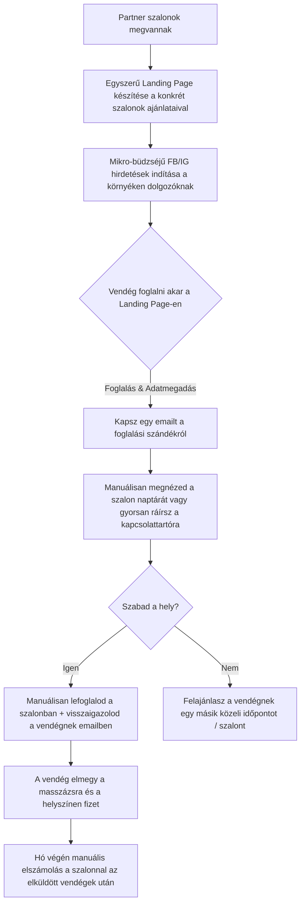

# Last-Minute Wellness - Validációs Stratégia

Ez a dokumentum összefoglalja a "Last-Minute Wellness" (idle capacity marketplace) koncepció keresleti (demand) és kínálati (supply) oldalának legköltséghatékonyabb, gyakorlati validációs lépéseit és elvárt metrikáit.

## 1. Keresleti Oldal (Demand) Validálása
**Módszer:** "Fake Door" (Ál-ajtó) teszt, Supabase / Tally integrációval, alacsony (napi 1.000 - 2.000 Ft) Facebook/Instagram hirdetési büdzsével.

### Go / No-Go Metrikák (Döntési pontok)

*   **CTR (Átkattintási arány a hirdetésen)**
    *   🟢 **GO (Tovább): > 1.5%** -> Valós a probléma, az ajánlat ("last minute masszázs kedvezménnyel") vonzó.
    *   🔴 **NO-GO (Kuka/Újratervezés): < 0.5%** -> Érdektelenség, vagy rossz a hirdetési üzenet (value proposition).
*   **CAC (Ügyfélszerzési Költség / Feliratkozó)**
    *   🟢 **GO: < 2.500 Ft** -> A tervezett ~2.100 Ft-os jutalékkal (take rate) és némi visszatérési rátával (repeat usage) a modell nyereséges tud lenni.
    *   🔴 **NO-GO: > 4.000 Ft** -> Túl drága az akvizíció, a modell minden új usert veszteséggel hozna be.
*   **CVR (Konverziós ráta a landing oldalon)**
    *   🟢 **GO: > 5%** -> Magas vásárlási szándék (High Intent). A userek a konkrét árak (10.500 Ft) és a "betelt" státusz ellenére is megadják az email címüket.
    *   🔴 **NO-GO: < 1-2%** -> Sok az "ablakvásárló" és az árérzékeny kuponvadász, akik lepattannak a konkrétumoknál.
*   **WTP (Fizetési hajlandóság és AOV)**
    *   🟢 **GO:** A userek legalább 30%-a a drágább opciót (pl. 90 perc) vagy az upsellt (pl. aromaterápia) választja.

---

## 2. Kínálati Oldal (Supply) Validálása
**Módszer:** Strukturált B2B Reachout (Partner Interjú) és kockázatmentes Próba-Ajánlat.
Nem " mystery-shopper" módszerrel trükközünk, hanem nyílt, partneri párbeszédet kezdeményezünk 10-12 budapesti prémium szalon tulajdonosával/vezetőjével (elsősorban Instagram DM-ben), hogy validáljuk a problémát, az operációs súrlódást és a diszkont-hajlandóságot.

### A B2B Reachout Folyamat (Személyre szabott E-mail Szekvencia)

Mivel a prémium szalonok jelentős része nem aktív Instagram/Facebook DM-ben, a leghatékonyabb hivatalos csatorna a **személyre szabott e-mail**. A sablonos hírleveleket azonnal törlik, ezért az e-maileknek rendkívül rövidnek, célratörőnek kell lenniük.

#### 1. Lépés: A Nyitó E-mail (Személyre szabott és Célratörő)

*   **Tárgy:** *„Üres időpontok a következő 24 órában”*
*   **Küldési idő:** Keddtől csütörtökig, délelőtt 9:00 - 11:00 között (ekkor a legmagasabb az e-mailek megnyitási aránya).

> 📬 **Nyitó E-mail:**
>
> *„Kedves [Szalon neve]!*
>
> *Több szalon foglalási rendszerét áttekintve azt láttam, hogy időnként még az adott napon is maradnak szabad időpontok.*
>
> *Egy olyan rendszeren dolgozunk, amely budapesti masszázs- és wellness szalonoknál ezeket az utolsó pillanatban bent maradó időpontokat tölti fel last-minute vendégekkel, kizárólag sikerdíjas alapon (nincs semmiféle fix díj vagy előfizetés).*
>
> *Az eddigi beszélgetések alapján ez sok szalonnál havi szinten átlagosan 10-30 üres órát jelenthet, ami részleges feltöltés esetén is már érezhető plusz bevételt adhat.*
>
> *Ha válaszolnak erre a levélre, meg tudjuk nézni, hogy Önöknél mennyi plusz bevételt lehetne a rendszerünk segítségével teremteni.*
>
> *Ha Ön nem a megfelelő kapcsolattartó ebben a témában, megköszönöm, ha továbbítja ezt az e-mailt az illetékes döntéshozónak.*
>
> *Amennyiben bármi felmerül, állok rendelkezésükre.*
>
> *Üdvözlettel,*
> *[Neved]*
> *ZenSlot”*

*   **Sales Pszichológia és miért működik:**
    *   **Tárgysor (kíváncsiságkeltő és sürgős):** Az „Üres időpontok a következő 24 órában” azonnal megnyitásra készteti a szalonvezetőt, mert azt feltételezi, hogy egy vendég jelentkezne be sürgősen, vagy közvetlen üzleti lehetőségről van szó.
    *   **Első mondat: iparági kontextus** – jelzi, hogy ismerjük a szektor működését és valós naptár-vizsgálatokra építünk, nem egy generikus sablon-reklámot küldünk.
    *   **Kockázatmentesség kiemelése:** A „kizárólag sikerdíjas alap” és a „nincs semmiféle fix díj” azonnal lebontja a pénzügyi ellenállást.
    *   **Számszerűsített érték:** A „havi 10-30 üres óra” kézzelfoghatóvá teszi a kieső bevételt a tulajdonos fejében.
    *   **Puha, alacsony ellenállású CTA:** Nem akarunk azonnal értékesíteni vagy demót tartani, csak egy egyszerű választ kérünk a levélre a potenciális bevétel becsléséhez.
    *   **Döntéshozó elérése:** A továbbítási kérés segít átjutni a recepciós filteren, ha az e-mail az info@ címre érkezik.

---

#### 2. Lépés: A 3-4 napos Follow-up E-mail (Ha nem érkezett válasz)

Ha 3-4 napon belül nem kapsz választ, egy rövid emlékeztető e-mail statisztikailag **megduplázhatja** a válaszadási arányt.

*   **Tárgy:** *„Re: [Szalon Neve] – üres slotok"* (Ugyanabba a levélszálba válaszolva!)

> 📬 **Follow-up E-mail (3-4 nap múlva):**
>
> *„[Szalon Neve], csak egy gyors követés az előző levelemre.*
>
> *Ha esetleg van most is néhány üresebb óra a héten, amit szívesen feltöltenétek fizető vendéggel – csak írj vissza egy 'Igen'-t, és megírom a részleteket.*
>
> *[Neved]*
> *ZenSlot Alapító"*

*   **Miért működik:**
    *   **3 sor, semmi több.** A follow-up egyetlen célja: emlékeztetni és a legkisebb lehetséges akciót kérni. Minél rövidebb, annál nagyobb eséllyel válaszolnak.
    *   **Nincs magyarázkodás** (*„Tudom, hogy elfoglaltak..."*) – ezek gyengítik az üzenetet.
    *   **Egyetlen CTA: „Igen"-t írj vissza.** Ennél alacsonyabb ellenállású válasz nincs.

---

### Go / No-Go Metrikák a Szalonoknál (Min. 10-15 megkeresés alapján)

*   **1. Probléma Validáltsága (Capacity Pain)**
    *   🟢 **GO:** A válaszoló szalonok legalább **50%-a** (akik visszaírnak) elismeri, hogy a lemondások vagy a hétközi csendesebb órák érezhető bevételkiesést okoznak, és nyitottak a probléma megoldására.
    *   🔴 **NO-GO:** Kevesebb mint **15%** jelez üresedési problémát (pl. fix hetekre előre telve vannak).
*   **2. Ajánlat Validáltsága (Risk-Free Trial Acceptance)**
    *   🟢 **GO:** A megkeresett szalonok legalább **20-30%-a** nyitott a próbahét elindítására és belemegy, hogy átküldjük nekik az első vendégeinket.
    *   🔴 **NO-GO:** **0%** hajlandóság (mindenki elutasítja az e-mailt, vagy a jutalékos diszkont modellt).
*   **3. Operációs Hajlandóság (Friction Test)**
    *   🟢 **GO:** A szalonvezető hajlandó arra, hogy az üres óráit naponta egyszer elküldje nekünk e-mailben/WhatsApp-on a manuális próbahét alatt.
    *   🔴 **NO-GO:** A szalonok kijelentik, hogy semmilyen manuális adatközlésre nem hajlandóak, csak automata API-integráció esetén csatlakoznának.

---

## 3. A "Bridge" Fázis: Hogyan válaszoljunk a pozitív megkeresésekre?

Ez a legkritikusabb fázis, hiszen **valódi szoftver és felépített ügyfélbázis még nincs a hátad mögött**. Ezt nem hibának vagy hiányosságnak kell felfogni, hanem a modern startup-építés legbölcsebb és legköltséghatékonyabb módszerének (**Concierge / Wizard of Oz MVP**).

### A Stratégiai Keretezés: Zárt Alapító Partneri Program (Closed Pilot)
Ha egy szalon visszaír, hogy *"Igen, érdekel"* vagy *"Hogyan működne ez?"*, a titok az, hogy **exkluzivitást és prémium pozicionálást** sugárzunk. 
Ahelyett, hogy azt mondanád: *"Még nincs semmim, most fejlesztem"*, úgy keretezzük, hogy **most készítjük elő a zárt körű, kerületi kampányunkat**, és a környékről mindössze **5 exkluzív szalont** választunk ki alapító partnernek az első hullámba, hogy garantáljuk a minőséget és a fókuszt a bevezetés alatt.

### A "Bridge" Válasz E-mail Sablon

> 📬 **Válasz e-mail az érdeklődő szalonnak:**
>
> *„Kedves [Kapcsolattartó Neve / Szalon Vezető]!*
>
> *Örülök a nyitottságnak! A modellünk lényege, hogy teljesen kockázatmentes számotokra:*
>
> 1. **Csak sikerdíj van:** Nincs csatlakozási díj, nincs havidíj. Kizárólag akkor számolunk el jutalékot, ha ténylegesen vendéget küldünk a megadott üres slototokra.
> 2. **Last-Minute ösztönző:** A hozzánk érkező helyi irodai dolgozóknak egy **20%-os last-minute kedvezményt** biztosítunk a normál áraitokból, hogy gyors döntésre sarkalljuk őket. A fennmaradó összegből mi **15% közvetítői díjat** vonunk le (így a ti nettó bevételetek az egyébként teljesen üresen maradó órán a normál ár 68%-a lesz, ami még mindig tisztességes fedezetet nyújt a fix bérleti és bérköltségekre).
>
> *Mivel a kerületi (V. kerület / Ferenciek tere környéki) cégeknek szóló kampányunk indulását a jövő hónapra tervezzük, most választjuk ki azt az **5 exkluzív szalont**, akikkel elindítjuk a zárt tesztüzemet (pilot programot).*
>
> *Ha ez a konstrukció alapvetően szimpatikus nektek, kérlek válaszolj erre az e-mailre 3 rövid részlettel:*
>
> * **Melyik az a 2-3 legnépszerűbb masszázsotok**, amire a legszívesebben fogadnátok last-minute vendégeket?
> * **Mi a szalonotok pontos weboldala** vagy online foglalási felülete?
> * **Ki a közvetlen kapcsolattartó nálatok**, akivel a teszt alatt heti szinten egyeztethetünk?
>
> *Ha megvannak ezek az adatok, küldöm a partnerségi megállapodás egyszerűsített tervezetét, és lefoglaljuk a helyeteket a pilot programban.*
>
> *Üdvözlettel,*
> *[Neved]*
> *ZenSlot Alapító”*

---

### Mit validálunk ezzel a levéllel? (Micro-KPI-k)
1. **Árelfogadás (Price Tolerance):** Elfogadják-e a 20% discount + 15% commission (összesen ~32%-os engedmény a listaárból az üres órákra) modellt? Ha sokallják, felkínálhatsz egyedi kompromisszumot (pl. a próba alatt 10% jutalék), de ha mereven elutasítják a diszkontot, az komoly figyelmeztető jel a kínálati oldalon.
2. **Kompaktság & Elköteleződés:** Hajlandóak-e válaszolni a 3 egyszerű kérdésre? Ez mutatja a valódi elköteleződést (skin in the game).
3. **Adminisztrációs hajlandóság:** Készek-e a jövő hónapig várni a tesztre? (Ez időt ad neked a keresleti oldal tesztelésére).

---

### Hogyan futtassunk "Concierge MVP"-t (manuális közvetítést) az app elkészülte előtt?

Ha 3-4 szalon rábólint a fenti feltételekre és megadja a részleteket, **megvan a kínálati oldalad!** Most jön a varázslat: a keresleti oldal validálása **anélkül, hogy lefejlesztenél egyetlen sor kódot is.**

1. **A Landing Page (Fake Door + Manuális foglalás):** Készítesz egy gyönyörű, egyszerű, de rendkívül prémium hatású egyoldalas weboldalt (pl. Tally-val vagy egy egyszerű static HTML-lel). A fő üzenet: *"Last-minute prémium masszázsok az V. kerületben - 20% kedvezménnyel."*
2. **A "Színjáték" (Wizard of Oz):** Feltünteted a partnereid logóját és néhány konkrét, aktuális üres slotot (pl. *"Csütörtök 14:00 - Niradi Thai Masszázs - 14.500 Ft helyett 11.600 Ft"*). Amikor a user rákattint a "Lefoglalom" gombra, nem egy bonyolult fizetési kapu jön be, nem kérünk kártyát, hanem egy egyszerű űrlap nyílik meg: név, email, telefonszám.
3. **Manuális összekötés (The Concierge):** Amikor a vendég beküldi az űrlapot, te azonnal kapsz egy emailt. Manuálisan belépsz a szalon foglalási rendszerébe (vagy írsz a kapcsolattartónak), lefoglalod a vendégnek a helyet a megadott adatokkal, majd küldesz a vendégnek egy elegáns, automatizáltnak tűnő visszaigazoló emailt: *"Sikeres foglalás! Várunk szeretettel csütörtökön 14:00-kor a Niradi szalonban."*
4. **Fizetés és Elszámolás:** Az első hetekben a vendég a helyszínen fizet a szalonnak (a kedvezményes áron). Te a hó végén küldesz egy manuális számlát a szalonnak a 15% közvetítői jutalékról (ezt már a bejegyzett egyéni vállalkozásoddal teheted meg, amit pont ráérsz akkor elindítani, amikor az első 5-10 valós tranzakció sikeresen lezajlott).

**Miért ez a legjobb út?**
* **Nulla fejlesztési költség:** Nem költesz heteket/hónapokat kódolásra egy olyan ötletért, aminél lehet, hogy senki nem foglalna le semmit.
* **100% valós validáció:** Amikor egy vendég elmegy a szalonba, kifizeti a pénzt, és a szalon kifizeti neked a jutalékot, na **AZ** a validáció. Onnantól már bátran fejleszthetsz sprintben, mert tudod, hogy van piaca!

