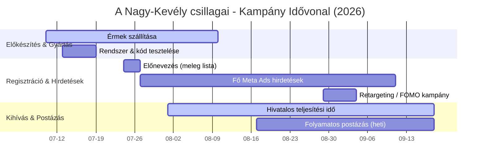

# 🏔️ A Nagy-Kevély csillagai – Kampány Specifikáció és Időterv

## 💰 Pénzügyi Alapadatok
*   **Nevezési díj:** 7 990 Ft (alanyi adómentes, AAM számlával)
*   **Házhozszállítási felár:** +1 200 Ft (opcionális, FoxPost)
*   **Foxpost csomagküldés:** Ingyenes a nevezési díjban
*   **Éremgyártási költség (100 db):** $502 DDP (~163 000 Ft mindennel együtt)
    *   *Gyártási egységár:* $1.02 / db
    *   *Szerszám/Öntőforma díj:* $140
    *   *Szállítási díj (DDP):* $260

---

## 📅 Kampány Menetrend (2026)

| Dátum / Időpont | Esemény | Fókusz / Teendő |
| :--- | :--- | :--- |
| **Július 10.** | **Éremgyártás indítása** | Alibaba fizetés teljesítése Kimmi Linnek ($502). |
| **Július 13. – 19.** | **Rendszer-teszt** | `stripe_raw2` tábla, Supabase és a Vercel backend tesztelése. |
| **Július 19. (Vasárnap, 19:00)** | **Előnevezés Start** | Hírlevél a korábbi 67 futónak egyedi ajánlói kódokkal. |
| **Július 22. (Szerda)** | **Meta Hirdetések Start** | Célközönség elérése (Bp. és agglomeráció). Hagyjuk a hirdetést tanulni. |
| **Augusztus 1. (Szombat)** | **Kihívás Start** | Megnyílik a teljesítés és a GPX feltöltő felület a portálon. |
| **Augusztus 8. – 13.** | **Érmek beérkezése** | Fizikai éremcsomag megérkezése a kínai gyártótól. |
| **Augusztus 17.** | **Első postázási hullám** | Az első teljesítők érmeinek feladása (Foxpost/Posta). |
| **Augusztus 24.** | **Retargeting Hirdetések** | Különálló, kis költségvetésű FOMO kampány indítása a hezitálóknak. |
| **Szeptember 6. (Vasárnap, 23:59)**| **NEVEZÉS LEZÁRÁSA** | A weboldalon és a checkout felületen leáll a fizetés. |
| **Szeptember 13. (Vasárnap, 23:59)**| **TELJESÍTÉS LEZÁRÁSA** | Utolsó nap a túra lefutására és a GPX feltöltésére. |
| **Szeptember 14. – 18.** | **Kampányzárás** | Utolsó érmek postázása, pénzügyi elszámolás (P&L), Börzsöny előkészítés. |

---

## 🛠️ Gyártási Paraméterek (Zhongshan One Way Craft Gift Co.)
*   **Méret & Vastagság:** 70 mm átmérő, 4.0 mm vastagság
*   **Kivitelezés:** 3D előlap, 2D hátlap, Soft Enamel festés (zöld)
*   **Fém felület:** Antik ezüst (Antique Silver)
*   **Hátlapi gravírozás:** csak VitaSteps logó
*   **Szalag:** Egyedi szövegezett nyomtatott poliészter szalag

---

## ⚙️ Adatkezelési és Automatizációs Pipeline
1.  **Stripe Checkout:** A `medals` tömböt JSON stringként küldi át a metadata-ban.
2.  **Google Sheets (`stripe_raw2`):** Minden megvásárolt éremhez külön sort ad hozzá a táblában a szállítási és teljesítési adatokkal.
3.  **Supabase (`runners` tábla):** Minden nevezőhöz egyedi rekordot hoz létre campaign-specifikus sorszámmal (pl. `#001/100-PK`). Több érem vásárlása esetén a rendszer automatikusan a `vevo+medalX` email-aliast használja a kulcsok szétválasztásához.
4.  **Számlázz.hu:** Automatikus e-számla generálás alanyi adómentes (AAM) formátumban, a tételek felsorolásával és szállítási díjjal.
5.  **Welcome Email:** Automatikus üdvözlőlevél küldése a portálos belépő linkkel és a letölthető virtuális **Kalandkönyv** (PDF) elérésével.

---

## 📈 Meta Ads, Költségvetés & Sell-out Stratégia
A cél a 100 db-os éremkészlet teljes értékesítése (sell-out) szeptember 13-ig (58 nap, átlagosan napi ~1.7 eladás szükséges). A pénzügyi fedezeti pont (break-even) ~45-60 eladott éremnél van.

### 💰 Hirdetési Költségvetési Terv (3 fázis)

#### 1. Validációs & Tesztfázis (Július 16. – Július 23.)
*   **Induló keret:** Napi **2 000 Ft**.
*   **Cél:** A hirdetési szövegek/kreatívok validálása és a valós ügyfélszerzési költség (CPA) kiderítése.
*   **Döntési fa az első 5-7 nap után:**
    *   **Ha a CPA kedvező (< 3 000 Ft):** Fokozatos skálázás indítása. A büdzsét 2-3 naponta növeljük max. **20-30%-kal** (pl. 2 000 Ft → 2 600 Ft → 3 300 Ft → 4 000 Ft).
    *   **Ha a CPA magas (> 4 500 Ft):** **NE** növeljük a büdzsét. Ehelyett állítsuk le a gyenge hirdetéseket, frissítsük a kreatívokat (kép/szöveg), vagy szűkítsük a hasonmás (LAL) célzást pontosabb túrázó érdeklődési körökre.

#### 2. Skálázási & Stabilizálási Fázis (Augusztus)
*   **Keret:** Napi **3 000 – 4 500 Ft** (tesztfázis eredménye alapján skálázva).
*   **Cél:** Stabil napi 1.5 - 2 eladás biztosítása.
*   **Retargeting:** Különítsünk el napi 500-800 Ft-ot az oldal-látogatók és kosárelhagyók visszacélzására, mivel sokan csak később konvertálnak.

#### 3. FOMO & Sell-out Fázis (Szeptember 1. – Szeptember 13.)
*   **Keret:** Napi **4 000 – 5 000 Ft**.
*   **Cél:** Az utolsó 15-25 érem gyors kisöprése.
*   **Üzenet:** Hirdetésekben és retargetingben hangsúlyozzuk a szűkösséget: *"Már csak X db érem maradt!"*, *"Szeptember 13-án a nevezés végleg lezárul!"*.

---

## 🎯 Meta Ads Célzás, Közönség-tanítás és Kizárások

### 1. Célközönség "Átmentése" (Lookalike - LAL)
Mivel a Meta Pixel már rendelkezik korábbi konverziós adatokkal, az új kampányt nem teljesen hideg közönséggel indítjuk:
*   **Vásárlói Hasonmás Közönség (1-2% LAL):** A meglévő 66 sikeres Prédikálószék-vásárló e-mail listáját (Stripe export) feltöltjük Custom Audience-ként, és ebből 1-2%-os magyarországi hasonmás (Lookalike) közönséget képzünk. Ezzel a Meta azonnal a leginkább releváns túrázókat/futókat fogja elérni.
*   **Pixel adatok újrahasznosítása:** Az elmúlt 180 nap weboldal-látogatói és elkötelezett social media követői automatikusan részét képezik a hirdetési optimalizációnak.

### 2. Költségoptimalizálás Kizárásokkal (Exclusions)
Hogy elkerüljük a felesleges hirdetési költéseket:
*   **Vásárlók kizárása:** A prospecting (új ügyfél szerző) kampányból **kifejezetten kizárjuk** az eddigi összes vásárlónkat (Stripe e-mail lista + akik elérték a `/predikalo/siker.html` vagy `/nagykevely/siker.html` köszönőoldalakat).
*   **Konvertáltak folyamatos kizárása:** Ahogy érkeznek az új Nagy-Kevély vásárlók, a Pixel és a Custom List segítségével őket is azonnal kivesszük a megjelenítések alól, így nem kapnak több hirdetést a vásárlás után.

---

## 🧭 Útvonalak és Élményelemek

### 1. Letölthető Virtuális Kalandkönyv (Túrafüzet)
A nevezők a sikeres fizetés után azonnal (illetve a személyes portáljukon keresztül túrázás közben is) letölthetik a **Nagy-Kevély Kalandkönyvet** (PDF):
*   **Történelmi háttér:** Érdekességek és kulisszatitkok az Egri Vár másolatának építéséről (az *Egri Csillagok* film forgatása az 1960-as években).
*   **Geológia játékosan:** A Teve-szikla dolomit tornyainak keletkezése.
*   **Túra-tippek:** Parkolás Pilisborosjenőn, vízvételi és pihenőhelyek.

### 2. Választható Túraútvonalak (4 különböző távolság)
Hogy minden edzettségi szintnek kedvezzünk, 4 különböző nehézségű útvonalat biztosítunk (GPX nyomvonalakkal):
1.  **Családi Kör (6–7 km):** Kezdő- és családbarát síkabb útvonal, amely érinti a Teve-sziklát és a várromot.
2.  **Kevély Kör (10 km):** A klasszikus közepes útvonal a Nagy-Kevély csúcsának érintésével.
3.  **Kevély Félmaraton (15 km):** Haladóbb futó/túrázó útvonal komolyabb szintemelkedéssel.
4.  **Kevély Ultra (20–25 km):** Tapasztalt sportolóknak szánt hosszú táv, a környék legszebb kilátópontjaival.

