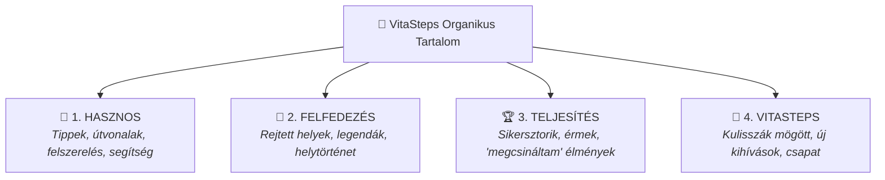

# Concept: Organic Content Pillars (Organikus Tartalmi Pillérek)

## 1. Core Principle: No AI-Slop, Real VitaSteps Material

A VitaSteps organikus tartalomstratégiája nem a tömeges, lélektelen mesterséges posztgyártásra épül. 
Az alapelv: **Valódi élmények és túrák nyersanyagai $\rightarrow$ AI-asszisztált struktúrálás $\rightarrow$ emberi szerkesztés és hiteles hangnem.**

Nem minden posztnak kell eladnia: a tartalom célja a megbízható, segítőkész jelenlét kialakítása a természetjáró és aktív közösségekben.

---

## 2. A 4 Fő Tartalmi Pillér

### 🥾 1. Hasznos (Utility & Practical Guidance)
* **Cél:** Önállóan is azonnali értéket nyújtani a túrázóknak.
* **Témák:**
  * Kezdőbarát túratippek és szezonális felszerelés-ajánlók.
  * „Hova menj hétvégén?” típusú 5–15 km-es útvonaljavaslatok Budapest környékén és vidéken.
  * Parkolási lehetőségek, vízvételi helyek, tömegközlekedési logisztika.

### 🌲 2. Felfedezés (Curiosity & Hidden Gems)
* **Cél:** Felkelteni a kíváncsiságot és a felfedezési vágyat.
* **Témák:**
  * Kevéssé ismert ösvények, barlangok, kilátópontok (pl. Teve-szikla geológiája, Egri vár másolata, Mackó-barlang titkai).
  * „Ezt biztosan nem tudtad a Pilisről/Börzsönyről” jellegű helytörténeti és néprajzi legendák.
  * Városi rejtett látnivalók és építészeti érdekességek.

### 🏆 3. Teljesítés (Celebration & Inspiration)
* **Cél:** A kitartás, a célkitűzés és a sikerélmény megünneplése.
* **Témák:**
  * Résztvevők valódi teljesítési történetei és csúcsfotói (UGC).
  * „Megcsináltam!” pillanatok: első 10 km, családi túrák gyermekekkel, szintemelkedések leküzdése.
  * A fizikai érem mint a megérdemelt elismerés kézzelfogható szimbóluma.

### 🧭 4. VitaSteps (Brand & Behind-the-Scenes)
* **Cél:** Emberivé és átláthatóvá tenni a márkát.
* **Témák:**
  * Új kihívások tervezése, éremminták és 3D minták készítése.
  * Kulisszák mögötti történetek: terepbejárások, távok kimérése, csomagolási rutin.
  * Közösségi bejelentések és limitált szériák állapota.
