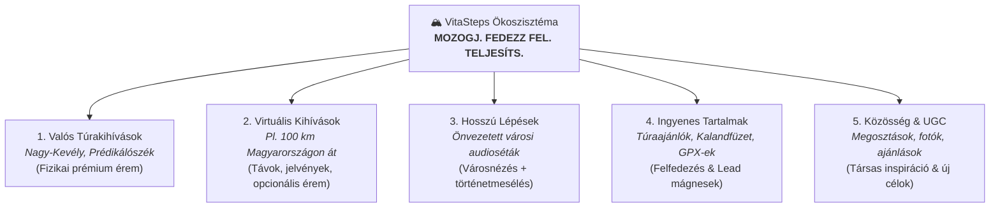

# Concept: Strategic Positioning (Stratégiai Pozicionálás)

## 1. Master Identity & Umbrella Message

> **„A VitaSteps egy mozgás-, felfedezés- és teljesítésközpontú élményrendszer.”**

### Fő üzenet (Umbrella Slogan)
# MOZOGJ. FEDEZZ FEL. TELJESÍTS.

A VitaSteps nem csupán egy túraérmeket forgalmazó webshop, hanem egy olyan élmény- és motivációs platform, amely játékos módon ösztönöz több mozgásra, természeti és városi helyek felfedezésére, valamint a kitűzött célok kézzelfogható megünneplésére.

---

## 2. The Core Value Shift

| Régi Modell (Termékközpontú) | Új Stratégia (Élményközpontú Ökoszisztéma) |
| :--- | :--- |
| **„Van egy túra, megveszed az érmet, teljesíted, kész.”** | **„Inspiráció $\rightarrow$ Mozgás $\rightarrow$ Cél $\rightarrow$ Teljesítés $\rightarrow$ Sikerélmény $\rightarrow$ Jutalom $\rightarrow$ Megosztás $\rightarrow$ Közösség $\rightarrow$ Következő Cél.”** |
| Az érem maga a termék. | Az érem a teljesítés kézzelfogható emléke és jutalma. |
| Egyetlen belépési pont: fizetett fizikai túra. | 5 különböző belépési pont (ingyenes tartalmaktól a prémium kihívásokig). |
| Egycsatornás növekedés: Meta Ads $\rightarrow$ Purchase. | Integrált hurok: Paid Ads + Organic + Lead Engine + Email + Community + UGC + Referral. |

---

## 3. Az 5 Belépési Pillér (The 5-Entry Ecosystem)

### 1. Valós túrakihívások ([[verified-challenge|Verified Challenge]])
* **Jelleg:** Konkrét földrajzi útvonalak és fizikai csúcsok (pl. [[campaign-nagykevely|Nagy-Kevély]], [[campaign-predikaloszek|Prédikálószék]]).
* **Folyamat:** Kiválasztás $\rightarrow$ saját tempójú teljesítés $\rightarrow$ igazolás $\rightarrow$ prémium 3D fémérem.

### 2. Virtuális kihívások ([[virtual-challenge|Virtual Challenge]])
* **Jelleg:** Helyszínfüggetlen mozgáscélok (pl. *"Tegyél meg 100 km-t a hónapban"*).
* **Folyamat:** Regisztráció $\rightarrow$ kilométerek rögzítése $\rightarrow$ haladás virtuális térképen $\rightarrow$ digitális mérföldkövek és jelvények $\rightarrow$ opcionális fizikai érem.

### 3. Hosszú Lépések ([[hosszu-lepesek|Hosszú Lépések]])
* **Jelleg:** Önvezetett, tematikus városi séták és hangos idegenvezetés (pl. *"Budapest rejtett titkai"*).
* **Folyamat:** Séta + GPS pozíció alapú hangos történetmesélés + városi felfedezés 60–90 percben.

### 4. Ingyenes tartalmak
* **Jelleg:** Digitális túraútvonal csomagok, nyomtatható [[campaign-nagykevely|Kalandfüzet]], túratippek és outdoor kalauzok.
* **Szerep:** Magas minőségű belépési pont, bizalomépítés és lead-generálás.

### 5. Közösség és Élményréteg
* **Jelleg:** Teljesítési történetek, csúcsfotók, „Kivel teljesítetted?” emlékek és közösségi elismerés.
* **Szerep:** Megerősítés, társas kötődés és a következő kihívás kiválasztása.

---

## 4. Stratégiai Prioritások (Execution Roadmap)

* **Prioritás 0 (Alapok):** Pozicionálás, ökoszisztéma modellezés, tudásbázis szinkronizáció.
* **Prioritás 1 (Organic & Lead Engine):** 4 tartalom pillér, kétheti batch tartalomgyártás, közösségi jelenlét 10 FB csoportban ("Help first"), email nurturing szekvencia, downstream lead minőségmérés.
* **Prioritás 1–2 (Összekapcsolt Növekedési Hurok):** Organic $\rightarrow$ Lead $\rightarrow$ Meta $\rightarrow$ Purchase hurok, UGC gyűjtés, ajánlói motor.
* **Prioritás 2 (Termékfejlesztési MVP-k):** Virtuális kihívás MVP (manuális kilométer-bevitel), Hosszú Lépések MVP (1 város, 1 séta).
* **Prioritás 3 (Validáció után):** Automatikus Garmin/Strava szinkronizáció, komplex mobilapplikáció, skálázott közösségi platform.

---

## 5. Anti-Scope: Amit MOST NEM építünk
1. **NEM** építünk azonnal komplex mobilappot.
2. **NEM** fejlesztünk hónapokig tartó Garmin/Strava API integrációt validáció nélkül.
3. **NEM** indítunk egyszerre 50 virtuális kihívást vagy 20 városi sétát.
4. **NEM** csinálunk napi szintű AI-slop tartalomgyárat.
5. **NEM** végzünk tömeges hideg üzenetküldést (cold DM).
