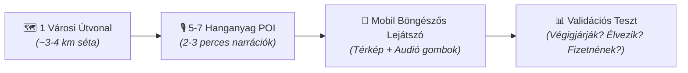

# Entity: Hosszú Lépések (Önvezetett Városi Audioséták)

## 1. Concept & Vision

A Hosszú Lépések a VitaSteps városi és kulturális felfedező pillére. 
Nem hegyi túrakihívás és nem klasszikus idegenvezetés: **egyéni tempójú, hangos történetmeséléssel kísért városi élményséta.**

> **Példa koncepció:** *„Budapest, amit sosem vettél észre – 7 rejtély a belváros szívében”*

### Élményelemek:
* GPS-koordinátákhoz kötött, automatikusan vagy manuálisan induló audio narrációk.
* Várostörténeti, építészeti és néprajzi érdekességek, kulisszatitkok.
* Saját ritmusban történő haladás: bármikor megállítható egy kávéra vagy fotóra.

---

## 2. MVP Specifikáció (Prioritás 2–3)

Nem fejlesztünk azonnal 50 sétát és országos lefedettséget. 
Az elv: **1 Város + 1 Séta + 60–90 Perc.**

### Tesztelési és Validációs Metrikák:
1. **Completion Rate:** Mennyien csinálják végig a teljes útvonalat?
2. **Engagement Score:** Végighallgatják-e a hanganyagokat?
3. **Willingness to Pay:** Hajlandóak-e mikro-tranzakcióként fizetni a prémium sétákért?
4. **Referral / Word-of-Mouth:** Megosztják-e barátaikkal az élményt?
