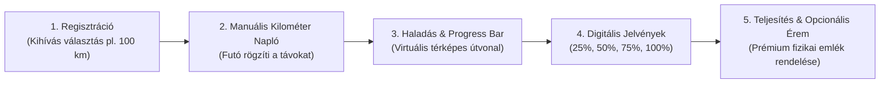

# Entity: Virtual Challenge (Virtuális Kihívás)

## 1. Concept & Ecosystem Role

A Virtuális Kihívások a VitaSteps azon belépési pillérét képezik, amelyek nincsenek egyetlen konkrét földrajzi hegycsúcshoz vagy lokációhoz kötve.

### Célja:
* Megszólítani azokat, akik nem tudnak elutazni a Pilisbe vagy a Dunakanyarba.
* Lehetőséget biztosítani a mindennapos mozgásra (futás, kutyasétáltatás, napi séta, túrázás bárhol az országban).
* Alacsony vagy ingyenes belépési küszöböt nyújtani a VitaSteps világába.

---

## 2. MVP Specifikáció (Prioritás 2)

Az elv: **Validate first $\rightarrow$ integrate later.** Nem fejlesztünk hónapokig tartó automatikus API integrációkat addig, amíg a manuális verzió népszerűsége nincs igazolva.

### MVP Funkciók:
1. **Felhasználói fiók:** A futó/túrázó kiválasztja a célt (pl. *„Járd végig virtuálisan a Balaton-felvidéket – 100 km”*).
2. **Egyszerű manuális távbevitel:** Dátum + megtett kilométer rögzítése.
3. **Vizuális visszajelzés:** Dinamikus folyamatsáv (progress bar) és virtuális mérföldkövek.
4. **Digitális elismerés:** Megosztható jelvények (badges) és digitális oklevél.
5. **Opcionális fizikai érem:** A teljesítéskor vagy előzetesen megvásárolható prémium fémérem.

---

## 3. Későbbi Fázis (Prioritás 3 – Csak sikeres validáció után)
* Automatikus Garmin Connect és Strava webhook integráció.
* Valós idejű GPS aktivitás szinkronizáció.
* Részletes csapat- és ranglista versenyek.
