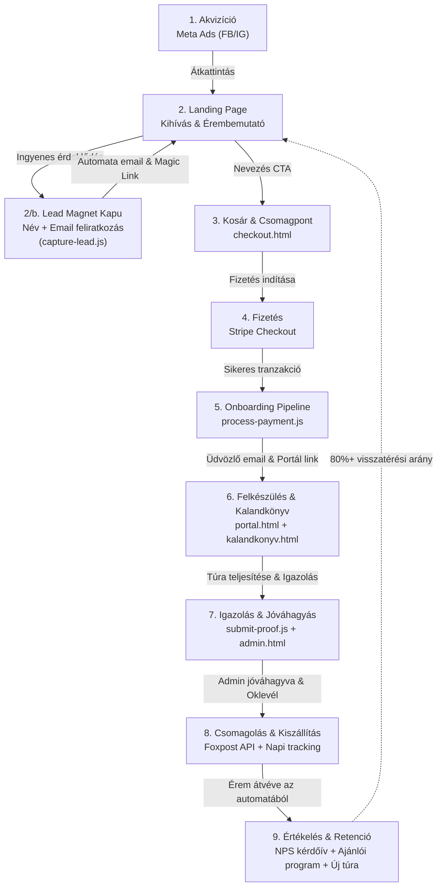

# Process: Customer Funnel & Lifecycle

A VitaSteps üzleti és vásárlói életciklusa a fizetett hirdetésektől a feliratkozási tölcséren és fizikai érem átvételén át a következő kihívásra való visszatérésig tartó zárt tölcsér (funnel).

---

## A Funnel Részletes Fázisai

### 1. Akvizíció (Traffic Acquisition – [[meta-ads|Meta Ads]])
* **Csatorna:** Meta Ads Manager (Facebook & Instagram hírfolyam és Story).
* **Célközönség:** 25–55 év közötti túrázók, természetjárók, futók és aktív életmódot élők.
* **Kreatív szögek:**
  * Kézben tartott, ékszer minőségű fémérem közeli fotója (erős vizuális vágykeltés).
  * Csúcsélmény, természetjáró szemszög (hiker kreatívok).
  * Sürgetés és ritkaság: *„Limitált, mindössze 100 darabos kézzel festett széria”*.
* **Mérés & Szinkron:** UTM paraméterezés (`utm_source=meta&utm_campaign=...`), automatikus napi adatlekérés a Marketing API-ból (`fetch_meta_daily.py`).

### 2. Érdeklődés és Lead Capture (Landing Page & Lead Magnet)
* **Felület:** `nagykevely/index.html` és `predikalo/index.html`.
* **Tartalom és bemutató:**
  * Nagy felbontású 3D / fotózott érembemutató, számozott limitált darabszám (100 db).
  * Dinamikus készletszámláló és visszaszámláló az éremfoglaláshoz.
* **Lead Magnet kapu (Gated Content):**
  * A **Kalandkönyv** és a **Túraútvonalak (GPX letöltések)** alapértelmezetten zárolva (lelakatolva) jelennek meg.
  * A látogató a nevét és e-mail címét megadva kattinthat a *„Kérem a túraútvonalakat és a kalandkönyvet 🔓”* gombra.
  * **Backend feldolgozás (`/api/capture-lead.js`):**
    1. Felhasználó azonnali mentése / upsertje a Supabase `runners` táblába (és ha létezik, a `leads` táblába).
    2. Automatikus üdvözlő e-mail kiküldése Gmail SMTP-n keresztül a túraútvonalakkal és a közvetlen feloldó linkkel (`?lead=true#kalandkonyv`).
    3. A látogató böngészőjében azonnal feloldódnak a szekciók (`localStorage.vitasteps_lead_unlocked = 'true'`), szabaddá válik a GPX letöltés és közvetlenül megnyitható a nyomtatható Kalandkönyv (`nagykevely/kalandkonyv.html?lead=true`).

### 3. Kosár és Szállítási Cím megadása ([[checkout-pipeline|Checkout]])
* **Felület:** `checkout.html` (dinamikus kampánykonfiguráció a `config/campaigns.json` alapján).
* **Adatbekérés:**
  * Nevezési csomag kiválasztása (1 fő, 2 fő vagy 3 fős kedvezményes páros/családi csomag).
  * Foxpost csomagautomata interaktív kereső és választó (vagy opcionális házhozszállítás).
  * Számlázási név és cím.
  * Opcionális ajánlói kuponkód beváltása (1 000 Ft azonnali kedvezmény).
* **Backend:** `/api/checkout.js` létrehozza a Stripe Checkout Session-t részletes metaadatokkal.

### 4. Fizetés ([[stripe|Stripe Hosted Checkout]])
* **Módok:** Bankkártya, Apple Pay, Google Pay.
* **Biztonság és UX:** A Stripe által hosztolt, 3D Secure hitelesített, mobilra optimalizált fizetési felület.

### 5. Onboarding és Post-Payment Pipeline (`siker.html` $\rightarrow$ `api/process-payment.js`)
* **Webhook-mentes architektúra ([[ADR-002-webhook-free-payment|ADR-002]]):** A Stripe-ról visszatérő felhasználó böngészője aktiválja a folyamatot a `session_id` alapján.
* **Automatikus lépések:**
  1. Futó és rendelés rögzítése a [[supabase|Supabase]] adatbázisban (`runners`, `orders`, `runs` táblák).
  2. Egyedi sorszám kiosztása (pl. `#015/100-PK`).
  3. NAV-álló elektronikus számla generálása és kiküldése a [[szamlazz-hu|Számlázz.hu]] Agenten keresztül.
  4. Üdvözlő levél kiküldése a túracsomaggal (letölthető GPX-ek) és a személyes portál közvetlen belépési linkjével.

### 6. Felkészülés és Teljesítés (`portal.html` $\rightarrow$ `kalandkonyv.html`)
* **Kalandkönyv:** A portálon a túrázó legenerálhatja személyre szabott, nyomtatható Kalandkönyvét (térkép, ellenőrzőpontok, tanösvény állomások, élménynapló).
* **Túra leküzdése:** A résztvevő tetszőleges időpontban teljesíti a kijelölt távot, és GPS nyomvonalat rögzít (Strava, Garmin, GPX) vagy csúcsfotókat készít.

### 7. Teljesítés Igazolása és Jóváhagyás ([[proof-verification|Proof Verification]])
* **Igazolás feltöltése:** `portal.html` $\rightarrow$ `/api/submit-proof.js`:
  * A fájlok a Supabase Storage `medals/proofs/` mappájába kerülnek, az adatbázisban `proof_submitted = true` és a fájl URL-ek rögzülnek.
  * **Azonnali Pushbullet értesítés:** A rendszer a feltöltés pillanatában azonnal push értesítést küld az adminisztrátor telefonjára a futó nevével, sorszámával, a csatolt képek számával és közvetlen admin linkkel.
* **Adminisztráció:** Az `admin.html` felületen a beérkezett igazolások prioritással, a lista legtetején, képpel együtt jelennek meg.
* **Jóváhagyás:** Egyetlen kattintásra (`api/admin-approve.js`):
  * A státusz `completed = true` állapotba vált.
  * Elkészül a névre szóló digitális oklevél (`predikalo/oklevel.html`).
  * A rendszer gratuláló emailt küld az oklevél linkjével a futónak.

### 8. Csomagolás és Kiszállítás ([[order-fulfillment|Order Fulfillment]])
* **Csomagolási segédlet:** Az `admin.html` logisztikai modulja azonos szállítási pont vagy rendelés alapján egyetlen csomagba vonja össze a több fős érmeket.
* **Foxpost integráció:** Egykattintásos csomagcímke generálás és nyomtatás a [[foxpost|Foxpost]] API-n keresztül.
* **Csomagkövetés:** GitHub Actions napi háttérfolyamat (`daily_tracking.py`) monitorozza a csomagok állapotát a célautomatáig.

### 9. Értékelés, Ajánlás és Retenció (Post-Delivery Loop)
* **Kiváltó ok:** A Foxpost API jelzi, hogy a csomagot átvették (`received = true`).
* **Portál aktiváció:** A futó személyes felületén automatikusan megnyílik:
  1. **NPS és elégedettségi kérdőív:** Éremminőség, szállítási élmény, szöveges visszajelzés és éremfotó feltöltése (`feedbacks` tábla).
  2. **[[referral-program|Ajánlói Program]]:** Egyedi ajánlói link másolása (10% kedvezmény az ismerősnek, lépcsőzetes jutalom a futónak egészen az ingyenes nevezésig).
  3. **Következő kihívás ajánlása ([[returning-customer-rate|Retenció]]):** A Prédikálószék után a futók több mint 80%-a visszatért a Nagy-Kevély csillagai kihívásra, drasztikusan csökkentve az átlagos ügyfélszerzési költséget ([[cac|CAC]]).

---

## Kapcsolódó Metrikák és Konverziós Célok
* **Megtekintés $\rightarrow$ Kosár indítás:** 15–20%
* **Kosár $\rightarrow$ Sikeres fizetés:** 80–90%
* **Teljes konverzió (Látogató $\rightarrow$ Vásárló):** 2.0–3.5%
* **Hirdetési megtérülés:** [[roas|ROAS]] $\ge$ 4.0x
* **Vásárlói elégedettség:** NPS $\ge$ 9.5/10
* **Visszatérő vásárlási arány:** [[returning-customer-rate|Returning Customer Rate]] $\ge$ 50%
