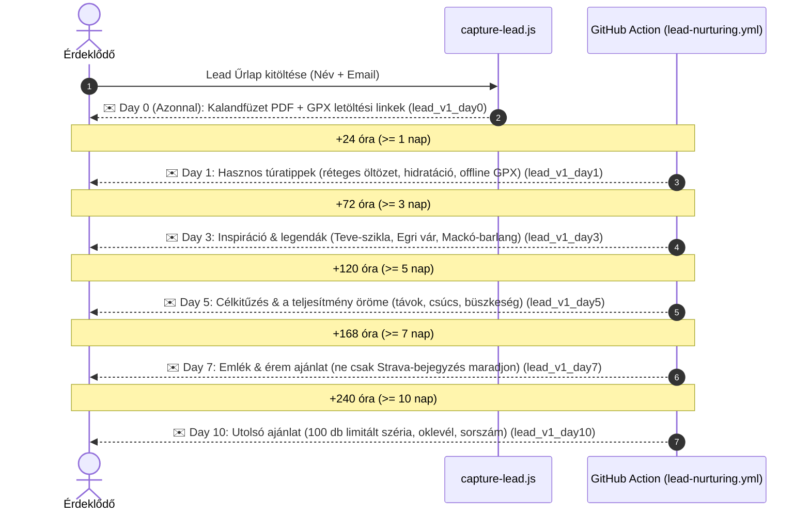

# Process: Lead Nurturing Sequence (Lead Gondozási E-mail Automatizáció V1)

A lead magnet ([[campaign-nagykevely|Kalandfüzet & GPX letöltés]]) feliratkozóinak automatikus 6 lépéses onboarding email sorozata, amely értékadással és természetes átvezetéssel vezeti a túrázót a fizikai éremigénylésig.

## 1. Sequence Lépések és Időzítések



---

## 2. A Levelek Részletes Specifikációja

| Lépés | Időzítés (Késleltetés) | Tárgy | Email ID | Cél & Tartalom | Sablon |
| :--- | :--- | :--- | :--- | :--- | :--- |
| **Day 0** | Azonnal | *🗺️ Nagy-Kevély Túraútvonalak és Kalandfüzet – VitaSteps* | `lead_v1_day0` | Lead magnet közvetlen átadása, GPX csomag és Kalandfüzet | `email_templates/lead_nurture/v1_day0.html` |
| **Day 1** | $\ge$ 24 óra | *🌲 4 praktikus tipp, hogy a legtöbbet hozd ki a hétvégi túrádból – VitaSteps* | `lead_v1_day1` | Értékadás: réteges öltözet, folyadék, offline GPX, fotópontok | `email_templates/lead_nurture/v1_day1.html` |
| **Day 3** | $\ge$ 72 óra | *🏰 Teve-szikla, Egri vár és Mackó-barlang: A Kevély elrejtett titkai* | `lead_v1_day3` | Inspiráció: az 1968-as Egri vár díszlete, Teve-szikla, jégkorszaki barlang | `email_templates/lead_nurture/v1_day3.html` |
| **Day 5** | $\ge$ 120 óra | *🎯 Miért jó célt kitűzni a túrákon? A teljesítmény igazi öröme* | `lead_v1_day5` | Átvezetés: túratávok kiválasztása, célkitűzés és belső büszkeség | `email_templates/lead_nurture/v1_day5.html` |
| **Day 7** | $\ge$ 168 óra | *🏅 Legyen kézzelfogható emléked a túráról! (A Nagy-Kevély kihívás)* | `lead_v1_day7` | Nem agresszív ajánlat: fémérem, oklevél, Foxpost szállítás | `email_templates/lead_nurture/v1_day7.html` |
| **Day 10** | $\ge$ 240 óra | *🌟 Megcsináltad a túrát? 100 darabos limitált érem – Nagy-Kevély* | `lead_v1_day10` | Őszinte záró ajánlat: 100 darabos széria, visszamenőleges igazolhatóság | `email_templates/lead_nurture/v1_day10.html` |

---

## 3. Technikai Architektúra & Adatbázis

### Adatbázis mezők (`leads` tábla)
* **`sequence`:** Verziózott azonosító (alapértelmezett: `'lead_nurture_v1'`).
* **`sequence_started_at`:** A sequence indulásának ideje (alapértelmezetten a feliratkozás `created_at`).
* **`last_sequence_step`:** Utoljára sikeresen kiküldött lépés (`0`, `1`, `3`, `5`, `7`, `10`).
* **`last_sequence_sent_at`:** Utolsó levélküldés időbélyege (garantálja a legalább 20 órás szünetet lépések között).

### Idempotencia & Biztonsági Garanciák
1. **Régi leadek kizárása:** A 2026. október 1. előtt keletkezett (`created_at < '2026-10-01'`) leadek `last_sequence_step = 10` értéket kapnak és a kód szigorúan átugorja őket, így sosem kapnak új levelet.
2. **Vásárlás védelem (Nurture Stop):** Minden kiküldés előtt a rendszer ellenőrzi a `leads.converted` állapotot, valamint a `runs` és `orders` táblákat. Ha a felhasználó bármikor vásárolt, a nurture azonnal és véglegesen leáll.
3. **Leiratkozás védelem:** Ha `unsubscribed = true`, egyetlen további email sem mehet ki.
4. **Időablak ellenőrzés:** A levelek kiküldése kizárólag nappali időablakban történik (**08:00 – 19:00 Europe/Budapest**). Éjszaka a GitHub Action nem zavarja a címzetteket.

---

## 4. URL Tracking & Analytics Események

Minden levél linkje kizárólag a **lead azonosítóját (UUID)** tartalmazza, sosem nyers email címet:
```text
https://vitastepsss.vercel.app/nagykevely/index.html?lead={LEAD_ID}&source=email&email_id={EMAIL_ID}&sequence=lead_nurture_v1#kalandkonyv
```

### Integrált Analytics Események (`analytics_events` tábla):
* **`lead_created`:** Feliratkozáskor (`api/capture-lead.js`)
* **`lead_email_sent`:** Sikeres email kiküldésekor (Day 0–10)
* **`lead_email_clicked`:** Amikor a lead az emailben lévő CTA linkre kattint (`js/tracker.js`)
* **`lead_checkout_started`:** Amikor a lead a pénztárba lép (`js/tracker.js`)
* **`lead_unsubscribed`:** Leiratkozáskor (`api/unsubscribe.js`)

---

## 5. Kapcsolódó Kódok & Fájlok
* **`landing_predikalo1/api/capture-lead.js`:** Lead regisztráció és azonnali Day 0 küldés
* **`landing_predikalo1/scripts/run_lead_nurture_sequence.js`:** Napi idempotens sequence küldő motor
* **`.github/workflows/lead-nurturing.yml`:** Napi 4x ütemezett GitHub Actions feladat
* **`landing_predikalo1/email_templates/lead_nurture/`:** A 6 db reszponzív email sablon
* **`landing_predikalo1/api/unsubscribe.js`:** Leiratkozás kezelő és eseménynaplózó
* **`landing_predikalo1/supabase_lead_nurturing_schema.sql`:** DDL migrációs script
