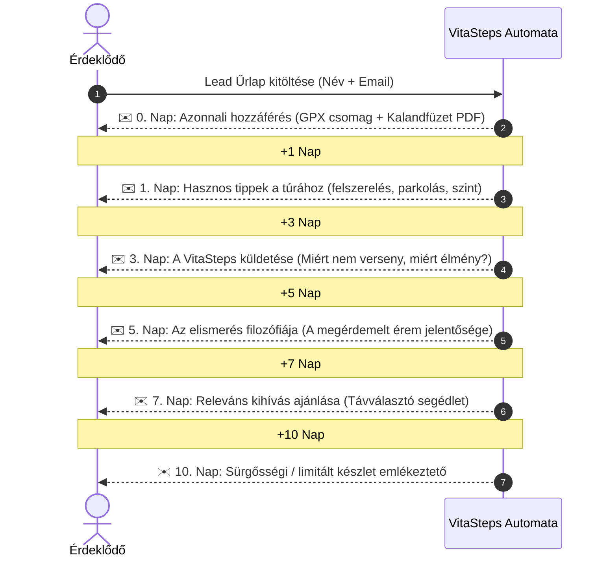

# Process: Lead Nurturing Sequence (Lead Gondozási E-mail Automatizáció)

## 1. Sequence Roadmap (0–10 Napos Automata Folyamat)

A lead magnet ([[campaign-nagykevely|Kalandfüzet & GPX letöltés]]) nem önmagában végpont, hanem a bizalomépítés és a konverzió nyitánya.

---

## 2. A Levelek Részletes Tartalma

| Időzítés | Tárgy & Cél | Tartalom fókusz |
| :--- | :--- | :--- |
| **0. Nap (Azonnal)** | *🗺️ Nagy-Kevély Túraútvonalak és Kalandfüzet* | Letöltési linkek átadása, azonnali pozitív élmény. |
| **1. Nap (+24h)** | *🎒 Így hozd ki a legtöbbet a hétvégi túrádból* | Hasznos útmutató: hol érdemes megállni, rejtett látnivalók, biztonsági tippek. |
| **3. Nap (+72h)** | *🌲 Miért hoztuk létre a VitaSteps-et?* | Hiteles márkatörténet, a saját tempójú felfedezés öröme, kiszakadás a hétköznapokból. |
| **5. Nap (+120h)** | *🏅 Egy emlék, ami kézzelfoghatóvá teszi a teljesítményedet* | Miért fontos megünnepelni a célba érést? A kézzel festett érem mint életre szóló emlék. |
| **7. Nap (+168h)** | *🧭 Családi séta vagy félmaraton? Találd meg a távodat!* | Távok bemutatása, kedvezményes páros/családi nevezési lehetőségek ismertetése. |
| **10. Nap (+240h)** | *⏳ Már csak kevés érem maradt a szériából!* | Készletkorlát (100 db) és nevezési határidő hangsúlyozása, direkt CTA a checkoutra. |

---

## 3. Downstream Minőség & Konverzió Mérés

A lead kampányok sikerességét nem csupán a feliratkozási költség (CPL) alapján ítéljük meg, hanem a teljes életciklus konverziós láncán:

$$\text{Lead Created} \longrightarrow \text{Magnet Download} \longrightarrow \text{Email Open} \longrightarrow \text{Email Click} \longrightarrow \text{Landing Visit} \longrightarrow \text{Checkout Start} \longrightarrow \text{Purchase}$$

### Mérési Dimenziók:
1. **First-Touch Attribution:** Melyik organikus poszt vagy hirdetés hozta be az érdeklődőt?
2. **Last-Touch Attribution:** Melyik e-mail vagy retargeting hirdetés váltotta ki a közvetlen fizetést?
3. **Engagement Score:** Letöltötte-e a Kalandfüzetet? Megnyitotta-e a leveleket?
