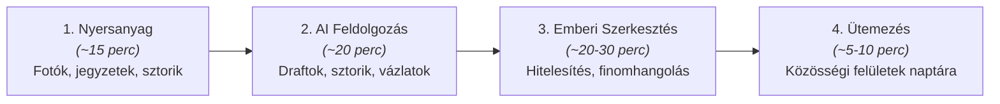

# Process: Organic Content Workflow (Kétheti Tartalomgyártási Folyamat)

## 1. Operating Rhythm: Kétheti Batch Rendszer

A fenntartható tartalomgyártás kulcsa a koncentrált, kétheti ~60 perces gyártási ciklus. Ezzel elkerülhető a napi ötletelés terhe és a minőségromlás.

---

## 2. A 4 Lépéses Gyártási Ciklus Részletei

### 1. Lépés: Nyersanyaggyűjtés (~15 perc)
Az elmúlt 2 hét valódi VitaSteps történéseinek és tapasztalatainak összegyűjtése:
* **Saját tereptapasztalat:** Hol jártunk, mit láttunk, milyen ösvény volt sáros vagy különösen szép?
* **Felmerült kérdések:** Mit kérdeztek tőlünk üzenetben, portálon vagy csoportokban?
* **Vásárlói élmények:** Milyen fotókat küldtek a teljesítők, milyen megható vagy inspiráló beszámoló érkezett?
* **Műhelyhírek:** Mi újság a csomagolással, éremgyártással, új útvonallal?

### 2. Lépés: AI-Asszisztált Vázlatkészítés (~20 perc)
A nyers tények és fotók átadása az AI-nak a 4 pillér ([[organic-content-pillars|Organic Content Pillars]]) mentén:
* **Készülő csomag kéthetente:**
  * 3–4 db Facebook szakmai/élmény poszt (Hasznos & Felfedezés),
  * 1 db Engagement / közösségi kérdés-poszt (pl. *„Ti melyik kilátót szeretitek jobban?”*),
  * 1 db Story ötlet sorozat (interaktív szavazás / matricás kvíz),
  * 1 db Soft-sell / Lead magnet ajánló tartalom (pl. *„Töltsd le a hétvégi GPX-et és a Kalandfüzetet!”*).

### 3. Lépés: Emberi Szerkesztés & Hitelesítés (~20–30 perc)
* Az AI által készített vázlatok átolvasása.
* AI-klisék („Nem mindennapi élményben volt részünk!”, „Lélegzetelállító panoráma”) kiszűrése.
* A VitaSteps közvetlen, természetes, földközeli stílusának érvényesítése.

### 4. Lépés: Ütemezés & Publikálás (~5–10 perc)
* Posztok és képek betöltése a Meta Business Suite vagy ütemező naptárba.
* Kétheti egyenletes elosztás (heti 2–3 minőségi poszt).
