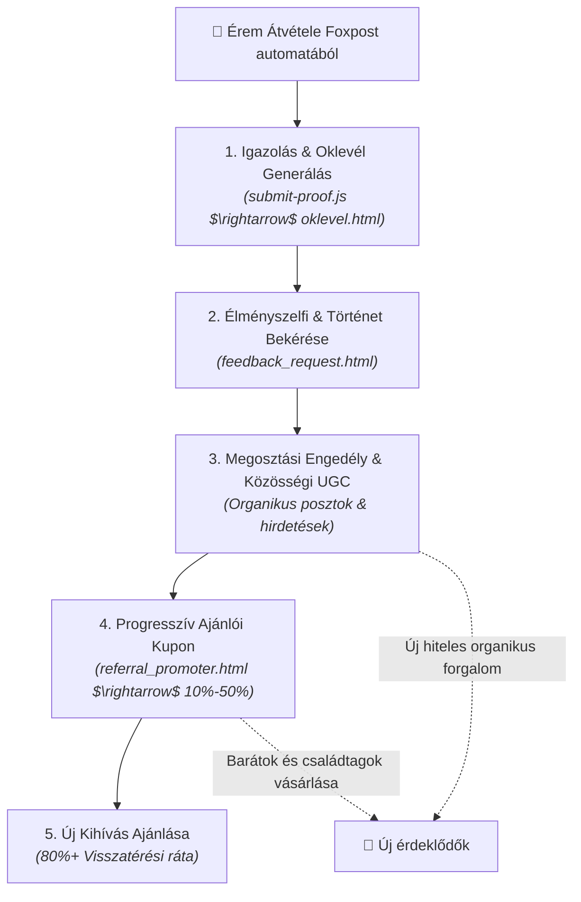

# Process: UGC & Referral Engine (Felhasználói Tartalom és Ajánlási Motor)

## 1. The Post-Purchase Flywheel

A vásárló és teljesítő nem a tölcsér végpontja, hanem a következő növekedési hullám legfontosabb kiindulópontja.

---

## 2. A Folyamat 5 Alappillére

### 1. Teljesítésigazolás & Digitális Oklevél
* A túrázó a portálon feltölti GPX-ét vagy csúcsfotóját.
* Az adminisztrátori jóváhagyás után azonnal letöltheti a személyre szabott, sorszámozott digitális oklevelét (`oklevel.html`).

### 2. NPS & Élményértékelés (Automata követés)
* A Foxpost csomagautomata nyitását követően (`daily_tracking.py`) a rendszer automatikusan kiküldi az élményértékelő kérdőívet (`feedback_request.html`).
* Cél: a 10/10-es NPS fenntartása és vásárlói idézetek gyűjtése.

### 3. UGC (User Generated Content) Repurposing
* A teljesítők által beküldött fotókat (engedéllyel) beépítjük az organikus közösségi posztokba és a Meta Ads kreatívokba.
* A valódi vásárló és túrázó fotója bizonyítottan magasabb konverziót eredményez, mint a steril termékfotók.

### 4. Progresszív Ajánlási Rendszer ([[referral-program|Referral Program]])
* Minden elégedett teljesítő saját ajánlói linket és 10%-os baráti kedvezménykupont kap.
* Sikeres ajánlásonként a teljesítő maga is növekvő (10% $\rightarrow$ 50%) saját jóváírást szerez.

### 5. Következő Kihívás Aktiválása (Retention)
* A kihívást teljesítők 80% feletti valószínűséggel neveznek be a következő VitaSteps túrára ([[returning-customer-rate|Returning Customer Rate]]).
* Az e-mail kommunikáció biztosítja, hogy a meglévő bázis azonnal értesüljön az új érmekről és útvonalakról.
