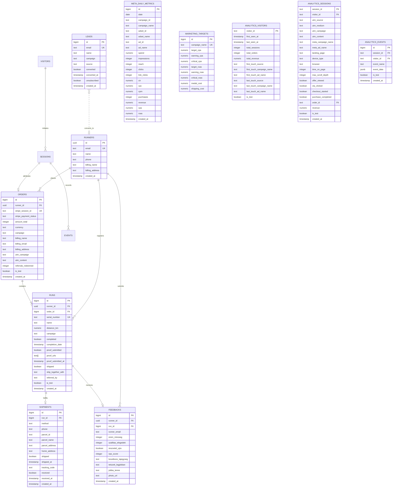

# System: Supabase (PostgreSQL & Storage)

Supabase serves as the persistent single source of truth for all VitaSteps operational, e-commerce, fulfillment, marketing, and analytics data.

## Entity-Relationship Architecture

## Relational Tables Overview

### 1. Core E-Commerce & Fulfillment
* **`runners`:** User profiles and customer registry (`id`, `email`, `name`, `phone`, `billing_name`, `billing_address`).
* **`orders`:** Financial Stripe transactions (`id`, `runner_id`, `stripe_session_id`, `stripe_payment_status`, `amount_total`, `campaign`, `utm_campaign`, `utm_content`, `is_test`).
* **`runs`:** Challenge registrations and medal completions (`id`, `runner_id`, `order_id`, `campaign`, `serial_number`, `distance_km`, `completed`, `completion_date`, `proof_submitted`, `proof_urls`, `shipped`, `ship_together_with`).
* **`shipments`:** Logistics records for Foxpost / Home Delivery (`id`, `run_id`, `method`, `parcel_id`, `parcel_name`, `home_address`, `phone`, `shipped`, `shipped_at`, `tracking_code`, `received`).
* **`feedbacks`:** Post-completion ratings, reviews, and photo submissions (`runner_id`, `run_id`, `nps_score`, `erem_minoseg`, `szallitas_elegedett`).
* **`leads`:** Lead capture entries for Kalandfüzet & route downloads (`email`, `name`, `campaign`, `source`, `converted`, `converted_at`).

### 2. Marketing & Unit Economics
* **`meta_daily_metrics`:** Daily ad-level and campaign-level Meta Marketing performance (`date`, `spend`, `impressions`, `clicks`, `purchases`, `revenue`, `cpa`, `roas`, `ad_name`, `campaign_name`).
* **`marketing_targets`:** Target CAC, ROAS, and unit thresholds per campaign.

### 3. Analytics & Attribution Engine
* **`analytics_visitors`:** Multi-touch visitor tracking and lifetime value.
* **`analytics_sessions`:** Complete session journeys, engagement metrics, scroll depths, and conversion flags.
* **`analytics_events`:** Granular real-time event stream (`landing_session`, `cta_click`, `scroll_50/75/90`, `engaged_15s`, `foxpost_point_selected`, `checkout_submit_attempt`, `purchase`, `form_validation_failed`).

## Storage Buckets
* `proofs`: User GPX track uploads and summit selfie photos.
* `medals/finance`: Revolut bank statement CSVs.

## Security & Row-Level Security (RLS)
* Public anonymous access is locked down.
* Customer portal queries are scoped strictly to authenticated emails (`auth.jwt() ->> 'email' = email`).
* Admin operations use serverless Vercel endpoints authenticated via `ADMIN_SECRET` and the `service_role` key.
