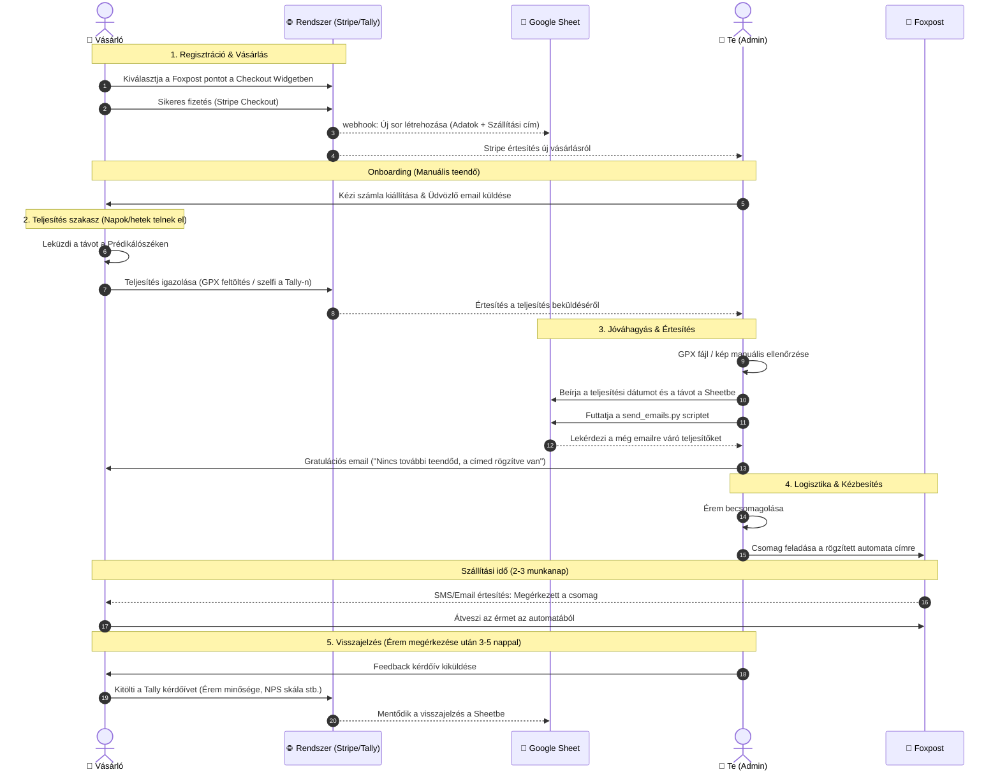

# 🏔️ VitaSteps Logisztikai és Időbeli Folyamatábra (Sequence Diagram)

A diagram az idő múlását felülről lefelé ábrázolja, és pontosan mutatja az interakciókat a szereplők (Vásárló, Weboldal/Stripe, Google Sheet, Te/Admin, és a Foxpost) között.

### 🕒 Időbeli eloszlás és felelősségi körök:
*   **Vásárlási szakasz (1-3. lépések):** Valós idejű, másodpercek alatt lefutó automatizmusok.
*   **Onboarding szakasz (4-5. lépések):** 24 órán belül elvégzendő manuális teendőid (Számlázás + Üdvözlő levél).
*   **Kihívás teljesítése (6. lépés):** A legváltozóbb időtartam (akár 1-4 hét is lehet a túrázó tempójától függően).
*   **Jóváhagyási szakasz (7-11. lépések):** Általában heti 1-2 alkalommal végzett kötegelt feldolgozás (GPX ellenőrzés + Python script futtatás).
*   **Kézbesítési szakasz (12-15. lépések):** 2-3 napos logisztikai tranzitidő a Foxpost hálózatában.
