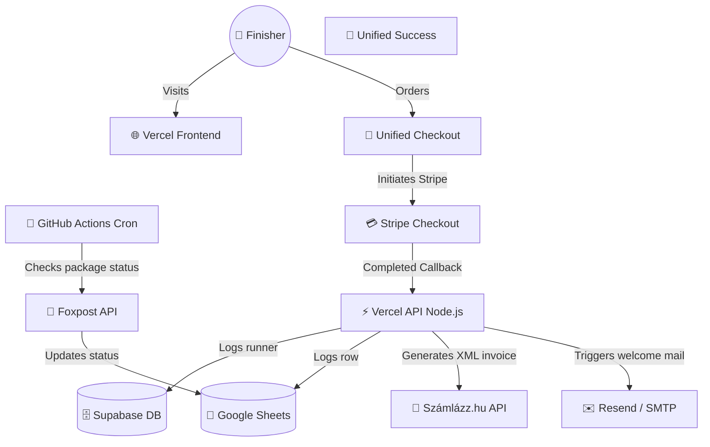

# 🏗️ Technical Architecture & Data Schema

This document details the system design, API routes, database schemas, and integration points for the VitaSteps challenge platform.

---

## 🗺️ System Topology



---

## ⚡ API Routes

### 1. `POST /api/checkout`
Pre-validates medal availability limits, generates a Stripe Checkout Session with dynamic quantities and shipping fees, and passes parameters inside metadata.
*   **Request Payload:**
    ```json
    {
      "medals": [{"name": "János", "distance": "15 km"}],
      "email": "janos@email.com",
      "phone": "+36301234567",
      "billingAddress": "1139 Budapest, Csizma u. 3",
      "deliveryMethod": "foxpost" | "home",
      "parcelCarrier": "foxpost",
      "parcelName": "FOXPOST Eger ALDI",
      "parcelAddress": "3300 Eger, Mátyás u. 138",
      "parcelId": "hu1004",
      "homeAddress": "",
      "referredBy": "friend@email.com",
      "isTest": false,
      "campaign": "pilis" | "predikaloszek"
    }
    ```

### 2. `POST /api/stripe-webhook`
Handles Stripe `checkout.session.completed` callback, creates invoices, logs rows, registers runner, and sends onboarding emails.

---

## 🗄️ Database Schema (Supabase `runners` table)

| Column | Type | Description |
| :--- | :--- | :--- |
| **email** | VARCHAR (PK) | Primary Key. Format: `email` or `email+medal{serial}` for multi-medal orders. |
| **name** | VARCHAR | Full name of the finisher. |
| **completed** | BOOLEAN | Completion validation state (True/False). |
| **completion_date** | DATE | Approved date of completion. |
| **shipped** | BOOLEAN | Package shipping status. |
| **received_date** | DATE | Finisher locker collection date. |
| **serial_number** | VARCHAR | Unique rank index (e.g. `#001/100-PK`). |
| **distance_km** | NUMERIC | Route length. |
| **referred_by** | VARCHAR | Email of the referrer. |

---

## 🤖 Automations & Logistics Crons
*   **Daily Tracking (`scripts/daily_tracking.py`):** Initiated via GitHub Actions daily at 16:30 UTC. Fetches locker delivery updates from the Foxpost API and registers updates in Google Sheets. Triggers follow-up emails via NodeMailer SMTP 3 days post-delivery to request reviews and invite users to the referral program.
