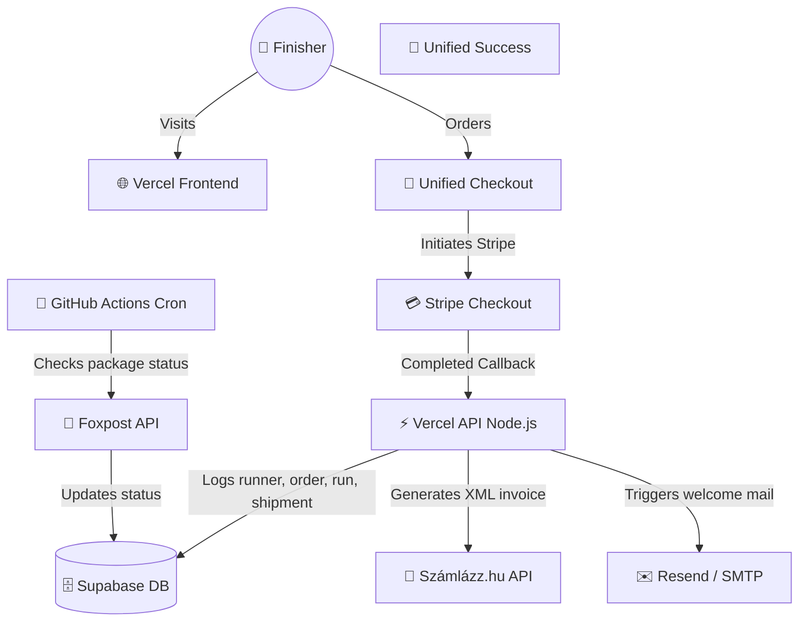

# 🏗️ Technical Architecture & Data Schema

This document details the system design, API routes, database schemas, and integration points for the VitaSteps challenge platform.

---

## 🗺️ System Topology



---

## ⚡ API Routes

### 1. `POST /api/checkout`
Pre-validates medal availability limits, generates a Stripe Checkout Session with dynamic quantities and shipping fees, and passes parameters inside metadata.
*   **Request Payload:**
    ```json
    {
      "medals": [{"name": "János", "distance": "15 km"}],
      "email": "janos@email.com",
      "phone": "+36301234567",
      "billingAddress": "1139 Budapest, Csizma u. 3",
      "deliveryMethod": "foxpost" | "home",
      "parcelCarrier": "foxpost",
      "parcelName": "FOXPOST Eger ALDI",
      "parcelAddress": "3300 Eger, Mátyás u. 138",
      "parcelId": "hu1004",
      "homeAddress": "",
      "referredBy": "friend@email.com",
      "isTest": false,
      "campaign": "pilis" | "predikaloszek"
    }
    ```

### 2. `POST /api/stripe-webhook`
Handles Stripe `checkout.session.completed` callback, creates invoices, logs runner/order/run/shipment entities in Supabase, and sends onboarding emails.

### 3. `POST /api/admin-approve`
Secure serverless function triggered by the admin dashboard to approve or reject a participant's completion proof. Requires `admin_secret` header verification, updates completion state, and triggers nodemailer congratulatory email with oklevél redirect links on approval.

---

## 🗄️ Database Schema (Supabase)

### 1. `runners` Table (User profiles)
Stores the personal identity details of registered runners.

| Column | Type | Description |
| :--- | :--- | :--- |
| **id** | UUID (PK) | Primary Key. |
| **email** | TEXT (UNIQUE) | Email address of the user. |
| **name** | TEXT | Billing / profile name. |
| **phone** | TEXT | Phone number. |
| **billing_name** | TEXT | Default billing name. |
| **billing_address** | TEXT | Default billing address. |
| **created_at** | TIMESTAMP | Registration timestamp. |

### 2. `orders` Table (Payment transactions)
Stores Stripe transaction details. One order can map to multiple runs.

| Column | Type | Description |
| :--- | :--- | :--- |
| **id** | UUID (PK) | Primary Key. |
| **runner_id** | UUID (FK) | References `runners.id`. |
| **stripe_session_id**| TEXT (UNIQUE) | Stripe checkout session ID. |
| **stripe_payment_status** | TEXT | Payment status (e.g. `paid`). |
| **amount_total** | INTEGER | Total amount paid (HUF). |
| **currency** | TEXT | Transaction currency. |
| **campaign** | TEXT | Challenge identifier (e.g. `pilis`). |
| **is_test** | BOOLEAN | Indicates if transaction was performed in sandbox mode. |
| **billing_name** | TEXT | Billing name. |
| **billing_email** | TEXT | Billing email address. |
| **billing_address** | TEXT | Full billing address. |
| **created_at** | TIMESTAMP | Creation timestamp. |

### 3. `runs` Table (Challenge registrations)
Stores individual challenge entries associated with a runner. A runner can have multiple rows (one for each challenge).

| Column | Type | Description |
| :--- | :--- | :--- |
| **id** | UUID (PK) | Primary Key. |
| **runner_id** | UUID (FK) | Foreign key pointing to `runners.id`. |
| **order_id** | UUID (FK) | References `orders.id`. |
| **name** | TEXT | Participant's name for the specific certificate/medal. |
| **completed** | BOOLEAN | Completion validation state (True/False). |
| **completion_date** | TEXT | Approved date of completion. |
| **shipped** | BOOLEAN | Package shipping status. |
| **received_date** | TEXT | Finisher locker collection date. |
| **serial_number** | TEXT (UNIQUE) | Unique rank index (e.g. `#001/100-PK` or `#042/100`). |
| **distance_km** | NUMERIC | Route length. |
| **campaign** | TEXT | Campaign key. |
| **is_test** | BOOLEAN | Indicates if this was a sandbox/test run. |
| **proof_submitted** | BOOLEAN | Indicates if the runner uploaded GPX/photo proofs. |
| **proof_urls** | TEXT[] | Array of public URLs containing uploaded proofs. |
| **proof_submitted_at** | TIMESTAMP | Timestamp when completion proof was uploaded. |
| **created_at** | TIMESTAMP | Creation timestamp. |

### 4. `shipments` Table (Shipping details)
Stores shipping details for each run.

| Column | Type | Description |
| :--- | :--- | :--- |
| **id** | UUID (PK) | Primary Key. |
| **run_id** | UUID (FK) | References `runs.id`. |
| **method** | TEXT | Shipping method (`foxpost` or `home`). |
| **phone** | TEXT | Recipient's phone number. |
| **parcel_id** | TEXT | Foxpost parcel locker ID (e.g. `hu1004`). |
| **parcel_name** | TEXT | Foxpost locker name. |
| **parcel_address** | TEXT | Foxpost locker address. |
| **home_address** | TEXT | Full home shipping address. |
| **shipped** | BOOLEAN | Indicates if shipped. |
| **shipped_at** | TIMESTAMP | Timestamp when shipped. |
| **received** | BOOLEAN | Indicates if received. |
| **received_at** | TIMESTAMP | Timestamp when received. |
| **created_at** | TIMESTAMP | Creation timestamp. |

### 5. `feedbacks` Table (NPS feedback)
Stores post-challenge feedback, linked to `runners` and `runs`.

| Column | Type | Description |
| :--- | :--- | :--- |
| **id** | UUID (PK) | Primary Key. |
| **runner_id** | UUID (FK) | References `runners.id`. |
| **run_id** | UUID (FK) | References `runs.id`. |
| **erem_minoseg** | INTEGER | Quality score (1-5). |
| **szallitas_elegedett** | INTEGER | Delivery score (1-5). |
| **reszvetel_ujra** | TEXT | Will participate again (Igen/Nem). |
| **nps_score** | INTEGER | Net Promoter Score (0-10). |
| **kovetkezo_tajegyseg**| TEXT | Next requested region. |
| **tetszett_legjobban** | TEXT | What was liked best. |
| **jobba_tenne** | TEXT | Feedback to improve. |
| **photo_url** | TEXT | Uploaded photo url. |
| **created_at** | TIMESTAMP | Creation timestamp. |

---

## 🤖 Automations & Logistics Crons
*   **Daily Tracking (`scripts/daily_tracking.py`):** Initiated via GitHub Actions daily at 16:30 UTC. Updates locker delivery status in Supabase. Triggers follow-up emails via NodeMailer SMTP 3 days post-delivery to request reviews and invite users to the referral program.
