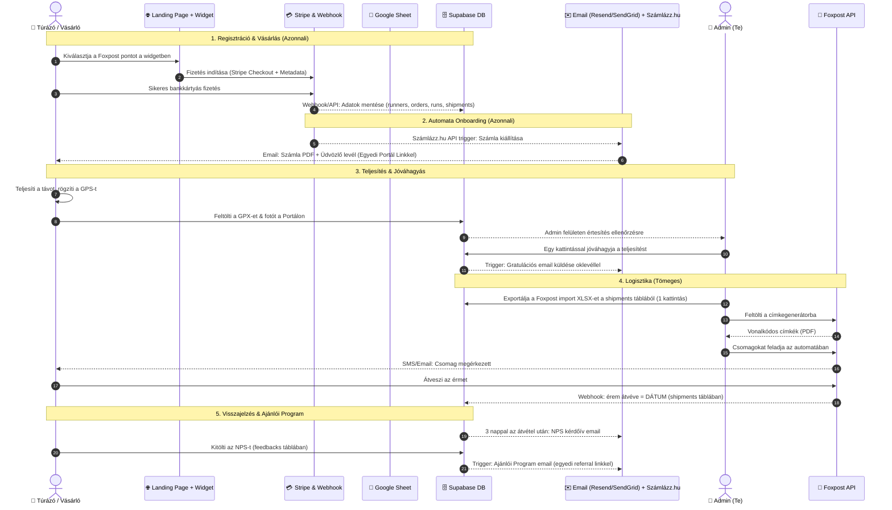

# 🏔️ VitaSteps – Automatizált Folyamat & Adat-Blueprint

Ez a dokumentum a következő kampányok teljes mértékben automatizált logisztikai és kommunikációs folyamatát írja le. Az első kampány manuális hibáiból tanulva (pl. hiányzó telefonszámok, kézi email küldés, utólagos csomagpont egyeztetés) minden lépéshez meghatározzuk a pontos **Inputokat**, **Outputokat** és az **Automatizációs Logikát**.

---

## 🔄 A Teljes Folyamat Áttekintése (Sequence Diagram)



---

## 📋 Részletes Fázis & Adat Blueprint

### 1. Fázis: Jelentkezés és Vásárlás (Checkout)
A legnagyobb fejlesztés az első kampányhoz képest, hogy **semmilyen szállítási adatot nem kérünk utólag**. Mindent a Stripe fizetés pillanatában szerzünk meg és szinkronizálunk.

*   **Bemenő adatok (Inputs):**
    *   *Túrázó adatai:* Név, E-mail cím, Telefonszám (kötelező mező a widgetben!).
    *   *Választott táv:* 10 km / 15 km / 20 km / 25 km.
    *   *Szállítási adatok:* Foxpost automata név, cím, egyedi automata ID (pl. `hu1004`).
*   **Automatizációs folyamat:**
    1.  A Landing Page-en lévő Foxpost widget elmenti a kiválasztott pont adatait a kliensoldali state-be.
    2.  Amikor a vásárló a "Nevezés" gombra kattint, a Stripe Checkout Session indításakor az összes fenti adatot beágyazzuk a `metadata` mezőbe:
        ```json
        {
          "Telefon": "+36301234567",
          "Tav": "15 km",
          "Csomagpont_id": "hu1004",
          "Csomagpont_neve": "FOXPOST A-BOX Eger ALDI",
          "Csomagpont_cim": "3300 Eger, Mátyás király út 138."
        }
        ```
    3.  A sikeres fizetés után a backend kód automatikusan lefut, és elmenti a vásárlói adatokat a `runners`, `orders`, `runs` és `shipments` táblákba a Supabase-ben.
*   **Kimenő adatok (Outputs):**
    *   Stripe sikeres tranzakció.
    *   Új, teljesen kitöltött adatsorok a Supabase adatbázisban (manuális adatrögzítés = 0).

---

### 2. Fázis: Automata Onboarding
Megszűnik a kézi számlázás és a manuális üdvözlő levelek küldözgetése.

*   **Bemenő adatok (Inputs):**
    *   Stripe Webhook sikeres fizetés esemény (E-mail, Név, Számlázási Cím, Összeg).
*   **Automatizációs folyamat:**
    1.  A Stripe webhook/API handler azonnal meghívja a **Számlázz.hu** API-t, amely kiállítja az e-számlát, és elküldi a túrázónak e-mailben.
    2.  Ezzel egy időben a rendszer a **Resend API**-n vagy SMTP-n keresztül kiküldi a hivatalos VitaSteps üdvözlő levelet.
    3.  A levél tartalmazza a személyre szabott Portál linket:
        `https://vitastepsss.vercel.app/portal.html?email=turanév%40gmail.com`
*   **Kimenő adatok (Outputs):**
    *   Kiállított e-számla PDF.
    *   Üdvözlő e-mail a Portál linkkel.

---

### 3. Fázis: Teljesítés igazolása és Jóváhagyás
Nincs szükség kézi emailezésre a jóváhagyás után. A portálon a felhasználó egyszerre több fájlt is feltölthet (pl. GPX nyomvonalat ÉS fotót is), javítva az első kampány korlátozásait.

*   **Bemenő adatok (Inputs):**
    *   A túrázó által a Portálra feltöltött GPX fájl(ok) és/vagy fotó(k) (több fájl egyidejű feltöltése támogatott a Supabase Storage-ba).
*   **Automatizációs folyamat:**
    1.  Az Admin felületen (`admin.html`) láthatóvá válik a beküldés.
    2.  A beküldést átnézed, majd rákattintasz a **"Jóváhagyás" (Approve)** gombra.
    3.  A jóváhagyás triggereli a backendet, ami:
        *   Beírja a Supabase-be a teljesítési dátumot és a valós paramétereket.
        *   Nodemailer segítségével automatikusan kiküldi a gratulációs e-mailt, benne az oklevél letöltési linkjével és a megerősítéssel, hogy az érem hamarosan indul a korábban megadott szállítási mód alapján.
*   **Kimenő adatok (Outputs):**
    *   Jóváhagyott státusz az adatbázisban.
    *   Automata gratulációs e-mail + digitális oklevél.

---

### 4. Fázis: Csomagfeladás és Szállítás (Foxpost)
Mivel a telefonszámok és a pontos automata adatok már a fizetésnél bekerültek a Supabase `shipments` táblájába, a postázás előkészítése teljesen automatikus.

*   **Bemenő adatok (Inputs):**
    *   Supabase `shipments` adatsorai (ahol a teljesítés már jóváhagyott, de a `shipped` még hamis).
*   **Automatizációs folyamat:**
    1.  Lefuttatod az érem-logisztikai Python scriptet. A script összegyűjti az összes teljesítőt a `shipments` táblából, akik még nem kaptak érmet, és kimenti őket egy Foxpost-kompatibilis tömeges import fájlba (XLSX).
    2.  A fájlt feltöltöd a Foxpost admin felületére. A Foxpost generálja a vonalkódos címkéket.
    3.  A címkéket kinyomtatod, felragasztod az érmek dobozára, és feladod őket az automatában.
    4.  A Foxpost API-n keresztül szinkronizáljuk a csomagkövetési státuszt, így a Supabase `shipments` táblában automatikusan frissül a `received` és `received_at` mező, amint a túrázó kivette az automatából.
*   **Kimenő adatok (Outputs):**
    *   Foxpost tömeges import táblázat (Supabase export).
    *   Nyomtatásra kész csomagcímkék.

---

### 5. Fázis: Visszajelzés és Ajánlói Program
A visszajelzések és ajánlások gyűjtése teljesen önműködővé válik, pontosan célozva a legelégedettebb futókat.

*   **Bemenő adatok (Inputs):**
    *   Az érem átvételének dátuma (Supabase `shipments.received_at`).
*   **Automatizációs folyamat:**
    1.  Egy háttérben futó ütemezett feladat (Cron job) figyeli a shipments tábla átvételi dátumait.
    2.  **3 nappal az érem átvétele után** automatikusan kiküldi az NPS elégedettségi kérdőív e-mailt a túrázónak.
    3.  A túrázó kitölti a visszajelzést (Supabase `feedbacks` tábla).
    4.  **Ha az NPS értékelés 9 vagy 10 (Promoter):** A rendszer azonnal kiküldi az automata **Ajánlói Program** levelet, amely tartalmazza az egyedi, másolható ajánlói linkjét:
        `https://vitastepsss.vercel.app/checkout-widget.html?ref=turazo_email%40gmail.com`
*   **Kimenő adatok (Outputs):**
    *   Automata NPS felmérő e-mail.
    *   Automata Ajánlói Program felkérő levél (csak a legelégedettebbeknek).

---

## 🛠️ Szükséges technikai integrációk a következő kampányhoz:

1.  **Stripe Metadata binding:** A landing page fizetési űrlapján a `checkout.session.create` API hívásban össze kell kötni a Foxpost widget változóit a Stripe metadata mezőivel.
2.  **API Handler / Webhook:** API endpointok (Vercel serverless function), amik feldolgozzák a sikeres tranzakciót és mentik az adatokat a Supabase normalizált tábláiba.
3.  **Számlázz.hu API:** Egyszeri beállítás a számlák automata kiállításához sikeres fizetés után.
4.  **Nodemail SMTP / Resend API:** A tranzakciós emailek (üdvözlő levél, gratuláció, feedback, referral) kiküldésére.
