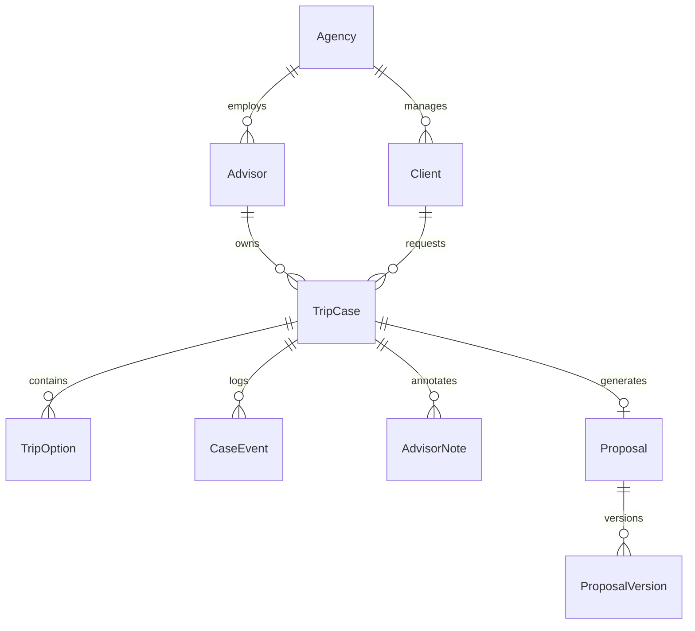

# 🏛️ Optivoya B2B Advisor Workspace — Master Architecture Blueprint (v1.0)

Ez a dokumentum az **Optivoya B2B Travel Advisor Workspace** teljes, implementációs szintű műszaki tervrajza. Célja, hogy egy mérnök vagy AI ágens a nulláról, külső kontextus nélkül is képes legyen a teljes rendszert maradéktalanul reprodukálni és üzemeltetni.

---

## 1. Termékstratégia & Rendszerarchitektúra

Az Optivoya termékcsalád egy közös, leválasztott döntési motor rétegre (**Shared Intelligence Layer**) épül, amelyből két különálló felhasználói élmény ágazik el:

```text
┌────────────────────────────────────────────────────────────────────────┐
│                        ALKALMAZÁSVÁLASZTÓ HUB                          │
│                                (/hub)                                  │
└───────────────────┬────────────────────────────────┬───────────────────┘
                    │                                │
                    ▼                                ▼
       ┌────────────────────────┐       ┌────────────────────────┐
       │  Master Travel Planner │       │   Advisor Workspace    │
       │       (/planner)       │       │       (/advisor)       │
       │   B2C / Személyes      │       │     B2B Tanácsadói     │
       │   Lineáris varázsló    │       │     Pult & CRM         │
       └────────────┬───────────┘       └────────────┬───────────┘
                    │                                │
                    └────────────────┬───────────────┘
                                     │
                                     ▼
       ┌─────────────────────────────────────────────────────────┐
       │              SHARED INTELLIGENCE LAYER                  │
       │  ├─ AHP Súlyozás & PROMETHEE II Rangsorolás             │
       │  ├─ Kiwi.com Járatkereső & Menetrend-analízis           │
       │  ├─ Cozycozy Szállásaggregáció & Ár-Érték Modell        │
       │  ├─ Open-Meteo Éghajlati & Hőmérsékleti Motor           │
       │  ├─ Numbeo Determinisztikus Megélhetési Modell          │
       │  ├─ 6-Fázisú Élmény- & Aktivitás Profilozás (OSM/Wiki)  │
       │  └─ Provenance, Hitelesítés & Kockázatelemző Motor      │
       └─────────────────────────────────────────────────────────┘
```

### 1.1 Fő Értékajánlat & KPI
* **Értékígéret:** *„Ügyféligényből 3 megalapozott, összehasonlítható és exportálható utazási döntési opció percek alatt.”*
* **Elsődleges Északi Csillag Metrika (North Star KPI):** **Total Research Time Saved / Case** (ügyenkénti kutatási idő csökkentése a korábbi 120+ percről $\le 45$ percre).

---

## 2. Adatmodell & Entitás-specifikáció (`app/models/advisor_models.py`)

A rendszer relációs és Pydantic modelljei tiszta, multi-tenant struktúrát követnek:



### 2.1 Entitás Struktúrák & Invariánsok

#### A) `TripCase` (Központi Ügy Aggregátum)
* `id` (`str`): Egyedi azonosító (`case_xxxxxxxx-xxxx-xxxx...`).
* `agency_id`, `advisor_id`, `client_id` (`str`): Multi-tenant kapcsolatok.
* `title` (`str`): Ügy megnevezése (pl. *„Olasz Tengerparti Nyaralás — Kovács Család”*).
* `status` (`TripCaseStatus`): Állapotgép (`brief` $\rightarrow$ `research` $\rightarrow$ `shortlist` $\rightarrow$ `proposal` $\rightarrow$ `waiting` $\rightarrow$ `revision` $\rightarrow$ `closed`).
* `scope` (`ResearchScope`): `FULL_TRIP`, `DESTINATION_DISCOVERY`, `FLIGHT_AND_STAY`, `FLIGHT_ONLY`, `STAY_ONLY`, `ACTIVITIES_ONLY`.
* `budget_mode` (`BudgetMode`): `TOTAL_BUDGET`, `COMPONENT_BUDGETS`, `SCOPE_ONLY`.
* `origin` (`str`), `destination_focus` (`Optional[str]`): Indulási és cél-fókusz.
* `adults` (`int`), `children` (`int`), `duration_days` (`int`): Utasok és időtartam.
* `date_mode` (`str`): `exact` (fix dátumok), `interval` (időablak), `month` (adott hónap).
* `total_budget_huf` (`Optional[float]`): Felső költségplafon forintban.
* `preferences` (`ResolvedTripPreferences`): Feloldott szigorú és súlyozott feltételrendszer.

#### B) `ProviderProvenance` (Adat-Eredet & Frissesség)
Minden külső adatpont (repülőjegy, szálloda, POI, időjárás) rendelkezik saját eredet-statisztikával:
* `provider` (`str`): `Kiwi`, `Cozycozy`, `Open-Meteo`, `Numbeo`, `OSM`, `Manual`.
* `checked_at` (`datetime`): Lekérés időpontja (UTC).
* `expires_at` (`datetime`): Lejárati idő a gyorsítótárban.
* `freshness_ttl_seconds` (`int`):
  * Kiwi járatok: $1800\,\text{s}$ ($30$ perc).
  * Cozycozy szállások: $3600\,\text{s}$ ($60$ perc).
  * Open-Meteo klíma: $86400\,\text{s}$ ($24$ óra).
  * Numbeo árak: $2592000\,\text{s}$ ($30$ nap).
* `verification_status` (`VerificationStatus`): `VERIFIED`, `ESTIMATED`, `STALE`, `NEEDS_REVIEW`, `UNAVAILABLE`.
* `raw_reference` (`Optional[str]`): Külső API foglalási azonosító vagy token.

---

## 3. Preferencia-feloldási Hierarchia (`PreferenceResolver`)

A rendszer a preferenciákat és szűrési szabályokat szigorúan **4 prioritási szinten** oldja fel:

$$\text{Advisor Overrides} \succ \text{Case Brief} \succ \text{Client Profile} \succ \text{System Defaults}$$

```text
1. Advisor Overrides (Manuálisan zárolt célpont, kiválasztott járat/szállás, egyedi árrés)
       ↓ felülírja
2. Case Brief (Az adott utazási igényhez megadott specifikus költségkeret, dátum és kényelmi igény)
       ↓ kiegészíti
3. Client Profile (Az ügyfél CRM profiljában rögzített tartós preferenciák: kedvenc légitársaságok, min. csillagszám)
       ↓ alapértelmezi
4. System Defaults (Alapértelmezett indulás: BUD, min. 3★, 2 felnőtt, 7 nap, 24°C ideális hőmérséklet)
```

### 3.1 Feltétel Kategóriák
1. **Hard Constraints (Szigorú Megkötések — Pass/Fail):**
   * $\text{Price} \le \text{TotalBudget} \cdot 1.35$ (max. 35%-os flexibilitási küszöb a kizárás előtt).
   * $\text{Stops} = 0$, ha $\text{direct\_flights\_only} = \text{True}$.
   * $\text{HotelStars} \ge \text{min\_hotel\_stars}$.
   * $\text{HotelRating} \ge \text{min\_hotel\_rating}$.
2. **Soft Preferences (Súlyozott Döntési Preferenciák — Skálázás 0–100):**
   * AHP 4-Pillér Súlyok: $w_{\text{dest}} + w_{\text{flight}} + w_{\text{stay}} + w_{\text{exp}} = 100$.
   * Vibe preferenciák: kultúra, gasztronómia, tengerpart, természet, éjszakai élet.
   * Járat prioritások: ár vs. menetidő vs. átszállások száma.
3. **Avoid Rules (Büntetett vagy Tiltott Elemek):**
   * Hajnali indulás ($\le 06:00$) vagy késő éjszakai érkezés ($\ge 23:30$) elkerülése.
   * Tiltott légitársaságok vagy célállomások.
4. **Nice-to-Have (Pozitív Bónusz Pontok):**
   * Reggeli az árban ($+5$ pont), medence ($+3$ pont), ingyenes lemondás ($+5$ pont), központi lokáció ($+5$ pont).

---

## 4. A 9 Tanácsadói Kutatási Stratégia (Research Pipelines)

Az [`AdvisorOrchestrationService`](file:///e:/Data/other_projects/dreamtrip/app/services/advisor_orchestration_service.py) 9 dedikált kutatási stratégiát hajt végre a `scope` és az igény alapján:

| # | Stratégia Megnevezése | Bemeneti Paraméterek | Végrehajtási Lépések | Eredmény |
|---|---|---|---|---|
| **1** | **Destination Discovery** | Indulási pont, dátum, költségkeret, preferenciák. | 1. 45+ célállomás szűrése klíma és költség alapján<br>2. Top 5 város kiválasztása<br>3. Párhuzamos járat- és szállásgyűjtés<br>4. 3 Archetípus szintetizálása. | 3 Opció különböző városokra. |
| **2** | **Known Destination** | Konkrét város (pl. Róma), dátum, költség. | 1. Célállomás validálása<br>2. Járatkínálat PROMETHEE II rangsorolása<br>3. Szálláskínálat mély szűrése<br>4. 3 Archetípus felépítése ugyanarra a városra. | 3 eltérő árfekvésű/stílusú opció a kiválasztott városra. |
| **3** | **Flight-First** | Indulás, dátum, repülési preferenciák. | 1. Kiwi járatmátrix lekérése<br>2. Legkedvezőbb járatok kiválasztása<br>3. Kapcsolódó szállások és transzferek hozzáillesztése. | Kiváló menetrendű csomagok. |
| **4** | **Stay-First** | Célváros vagy régió, szállás preferenciák. | 1. Prémium szállások keresése (Cozycozy)<br>2. Csatlakozó járatok felkutatása<br>3. Helyi programok szintézise. | Szállásközpontú opciók. |
| **5** | **Full-Trip Optimization** | Teljes bemeneti mátrix. | 1. Minden pillér együttes párhuzamos optimalizálása<br>2. TripScore harmonizálás. | Globálisan optimalizált csomag. |
| **6** | **Component-Only** | Csak járat vagy csak szállás kérés. | 1. Kizárólag a kért komponenst kutatja<br>2. Provenance csatolása. | Célzott komponenslista. |
| **7** | **Mixed-Scope** | 2–3 konkrét város összevetése. | 1. Párhuzamos csomagépítés a megadott városokra<br>2. Relatív összehasonlítás. | Városok közötti döntési mátrix. |
| **8** | **Re-Optimization** | Meglévő ügy + módosított megkötés. | 1. Meglévő stabil komponensek zárolása<br>2. Csak az érintett komponens újraszámolása<br>3. Audit esemény rögzítése. | Frissített 3 opció a kontextus megőrzésével. |
| **9** | **Find Better** | 1 kiválasztott opció finomhangolása. | 1. Lokális keresés a jobb hotelre vagy olcsóbb járatra<br>2. Trade-off kalkuláció. | Finomított alternatíva. |

---

## 5. A 3 Döntési Archetípus Szintézise (`MultiOptionEngine`)

A nyers jelöltcsomagokból a motor **pontosan 3 diszjunkt, döntésre kész archetípust** állít elő:

```text
Nyers Jelölt Halmaz (Raw Inventory Pool: 10–50 csomag)
                        │
                        ▼  [1. Hard Constraint Filter]
             Érvényes Jelöltek (Valid Candidates)
                        │
       ┌────────────────┼────────────────┐
       ▼                ▼                ▼
  Option A         Option B         Option C
BEST OVERALL      BEST VALUE     BEST EXPERIENCE
```

### 5.1 Matematikai Szelekciós Képletek

#### Option A: `BEST_OVERALL` (Kiegyensúlyozott Legjobb)
A legmagasabb összetett harmonizált `TripScore`-ral rendelkező jelölt:

$$\text{Option A} = \arg\max_{c \in \text{Valid}} \text{TripScore}(c)$$

$$\text{TripScore}(c) = \frac{w_{\text{dest}} S_{\text{dest}} + w_{\text{flight}} S_{\text{flight}} + w_{\text{stay}} S_{\text{stay}} + w_{\text{exp}} S_{\text{exp}}}{w_{\text{dest}} + w_{\text{flight}} + w_{\text{stay}} + w_{\text{exp}}}$$

#### Option B: `BEST_VALUE` (Legjobb Ár-Érték Arány)
A forintonként elérhető legmagasabb minőségi index:

$$\text{Option B} = \arg\max_{c \in \text{Valid} \setminus \{\text{Option A}\}} \left( \frac{\text{TripScore}(c)}{\max\left(\frac{\text{Price}_{\text{HUF}}(c)}{10\,000}, 1.0\right)} \right)$$

#### Option C: `BEST_EXPERIENCE` (Maximális Élmény & Prémium Kategória)
A legmagasabb kényelmi, szállodai és élményfaktor összeg:

$$\text{Option C} = \arg\max_{c \in \text{Valid} \setminus \{\text{Option A}, \text{Option B}\}} \left( 10 \cdot \text{Stars}(c) + 5 \cdot \text{Rating}_{\text{norm}}(c) + 4 \cdot N_{\text{activities}}(c) + 0.5 \cdot \text{TripScore}(c) \right)$$

### 5.2 Diverzitási Védelem (Diversity Safeguard)
Ha az adatbázisban kevés a jelölt és az algoritmus azonos csomagot választana az A, B vagy C helyre, a motor permutációs kereséssel automatikusan eltérő szállodát vagy járatot társít, garantálva a **3 valóban különböző alternatívát**.

---

## 6. Relatív Összehasonlító Motor (`RelativeComparisonService`)

A tanácsadói munka kulcsa a választási alternatívák közötti **különbségek és kompromisszumok (trade-offok)** azonnali láttatása:

### 6.1 Relatív Delta Számítások
Az `Option A` (Best Overall) képezi a viszonyítási bázist ($P_{\text{base}}$):

$$\Delta \text{Price}_{\text{nominal}} = \text{Price}_i - P_{\text{base}}$$

$$\Delta \text{Price}_{\%} = \frac{\text{Price}_i - P_{\text{base}}}{P_{\text{base}}} \cdot 100\%$$

$$\Delta \text{FlightDuration} = T_i^{\text{flight}} - T_{\text{base}}^{\text{flight}}$$

### 6.2 Összehasonlítási Dimenziók
1. **Teljes Csomagár & Ár/Fő** (legkedvezőbb megjelölése zölddel).
2. **Összetett TripScore** (0–100 skálán).
3. **Repülés & Menetrend** (közvetlen vs. átszállásos, légitársaság, hasznos nyaralási idő).
4. **Szállás Kategória** (csillagok száma, Booking/Google pontszám 0–10 skálán, lokáció).
5. **Gasztronómiai & Napi Költségek** (Numbeo determinisztikus napi kosárérték).
6. **Determinisztikus „Why This Option?” Indoklás** (sablonos AI-szövegek nélkül).

---

## 7. Feltétel-enyhítési Motor (`ConstraintRelaxationService`)

Ha a felhasználói brief túl szigorú (pl. közvetlen járat + 5★ hotel + max. 150 000 Ft) és a keresés **0 találatot (Dead-End)** ad, a rendszer nem áll meg hibával, hanem strukturált diagnózist és **1-kattintásos feloldási javaslatokat** állít elő:

```text
[0 Találat Diagnózis]
 ├─ 1. Költségkeret Enyhítés: +45 000 Ft (+15%) keretnövelés → 7 új prémium opció oldódik fel.
 ├─ 2. Átszállási Enyhítés: +1 kényelmes átszállás engedélyezése → 12 új járatos opció nyílik meg.
 ├─ 3. Szálláskategória Enyhítés: 5★ helyett 4★ engedélyezése → 9 új kiváló elhelyezkedésű szállás.
 └─ 4. Dátumablak Enyhítés: ±2 nap flexibilitás → 15 új opció kedvezőbb járatokkal.
```

Minden javaslathoz tartozik egy `patch` objektum, amellyel a tanácsadó 1 kattintással frissítheti a briefet és azonnal újraindíthatja a keresést.

---

## 8. Kockázatelemző & Figyelmeztető Motor (`TripRiskService`)

A rendszer valós idejű logisztikai és kényelmi kockázatokat detektál minden opcióra:

| Kockázati Típus | Trigger Feltétel | Súlyosság | Javasolt Tanácsadói Figyelmeztetés |
|---|---|---|---|
| `TIGHT_TRANSFER` | Átszállási idő $< 90$ perc | ⚠️ Közepes | *„Rövid átszállási idő (pl. 55 perc) — késés esetén poggyászvesztés kockázata.”* |
| `EARLY_DEPARTURE` | Járatindulás $< 06:00$ | ℹ️ Alacsony | *„Hajnali indulás (05:20) — reptéri transzfer éjszaka szükséges.”* |
| `LATE_ARRIVAL` | Érkezés a szállásra $> 23:30$ | ℹ️ Alacsony | *„Késő éjszakai érkezés — 24 órás recepció megerősítése ajánlott.”* |
| `LOW_RATING_RISK` | Hotel pontszám $< 7.2$ | ⚠️ Közepes | *„A szálloda értékelése elmarad a boutique sztenderdtől.”* |
| `PRICE_VOLATILITY` | Provenance kor $> 60$ perc | ℹ️ Alacsony | *„Nem frissített ár — ellenőrzés szükséges véglegesítés előtt.”* |

---

## 9. Ügyfélajánlat (Proposal) Verziókezelés & Export (`ProposalService`)

Az Advisor Workspace beépített ajánlatkészítő motorja:
1. **Pillanatfelvétel (Immutable Snapshot):** Az opciók kiválasztásakor a járat-, hotel- és költségadatok zárolásra kerülnek a `ProposalVersion`-ben, így a későbbi élő árváltozások nem módosítják a már kiküldött ajánlatot.
2. **Verziókövetés:** $v1 \rightarrow v2 \rightarrow v3$ módosítások audit naplóval.
3. **Megosztható Ügyféllink:** Egyedi token alapú privát nézet (`/api/advisor/proposals/{token}/view`).
4. **Nyomtatásbarát / PDF Export:** Kétnyelvű, tételes költségbontást és vizuális archetípus-összehasonlítást tartalmazó tiszta dokumentum.

---

## 10. REST API Végpont Szerződések (`app/routers/advisor_api.py`)

| Metódus | Útvonal | Leírás |
|---|---|---|
| `GET` | `/api/advisor/agency` | Ügynökségi profil és branding beállítások. |
| `GET` | `/api/advisor/kpis` | Tanácsadói KPI-k (aktív ügyek, megtakarított órák, konverzió). |
| `GET` | `/api/advisor/clients` | Ügyfél CRM lista és keresés. |
| `POST` | `/api/advisor/clients` | Új ügyfél rögzítése CRM preferenciákkal. |
| `GET` | `/api/advisor/cases` | Utazási ügyek listázása és szűrése állapot szerint. |
| `POST` | `/api/advisor/cases` | Új utazási ügy indítása brief paraméterekkel. |
| `GET` | `/api/advisor/cases/{case_id}` | Teljes ügy adatmodell lekérése opciókkal és audit idővonallal. |
| `POST` | `/api/advisor/cases/{case_id}/research` | Kutatási stratégia futtatása és 3 archetípus generálása. |
| `GET` | `/api/advisor/cases/{case_id}/compare` | Relatív összehasonlító mátrix és trade-off analízis. |
| `POST` | `/api/advisor/cases/{case_id}/relax` | Feltétel-enyhítési diagnózis lekérése 0 találat esetén. |
| `POST` | `/api/advisor/cases/{case_id}/proposals` | Új ajánlat verzió generálása zárolt pillanatfelvétellel. |
| `GET` | `/api/advisor/cases/{case_id}/proposals/{prop_id}/export` | HTML/PDF nyomtatható ajánlat renderelése. |

---

## 11. Kliensoldali UI Architektúra (`static/js/advisor/`)

A felhasználói felület desktop-first, gyors, reaktív JavaScript modulokból áll:
* `advisor_app.js`: Fő alkalmazás-vezérlő és nézetváltó router (`dashboard`, `clients`, `cases`, `brief`, `research`, `options`, `compare`, `proposals`, `timeline`, `settings`).
* `advisor_state.js`: Központi állapotkezelő (aktív ügy, kiválasztott opciók, kosár-szinkronizáció, helyi gyorsítótár).
* `advisor_research.js`: Valós idejű kutatási előrehaladás-jelző (progress bar) és opciókártya-renderelő.
* `advisor_option_compare.js`: Oszlopos döntési mátrix és interaktív szűrők.
* `advisor_proposal.js`: Ajánlatszerkesztő, bevezető/záró szövegek és azonnali PDF export bridge.

---

## 12. Minőségbiztosítás & Governance Invariánsok

1. **Anti-AI-Slop Szabályzat (`[[ANTI_AI_SLOP_POLICY]]`):**
   * Tilos a belső algoritmusnevek (PROMETHEE, AHP) megjelenítése a felületen.
   * Valós adatok használata (nincsenek fiktív mock járatok vagy kamu értékelések).
2. **Dizájnrendszer (`[[DESIGN_SYSTEM]]`):**
   * Zöld fenyő paletta (`--primary: #003710`, `--secondary-container: #a7f540`).
   * 3-szintű tipográfia: Plus Jakarta Sans (címek), Inter (szöveg), JetBrains Mono (számok/árak).
3. **Minőségi Kapuk (`[[QUALITY_GATES]]` & `[[DEFINITION_OF_DONE]]`):**
   * Minden új komponens 100%-os automatizált teszteléssel és érvényes tudásgráf-kapcsolatokkal (`python scripts/knowledge/validate.py`) kerül lezárásra.
