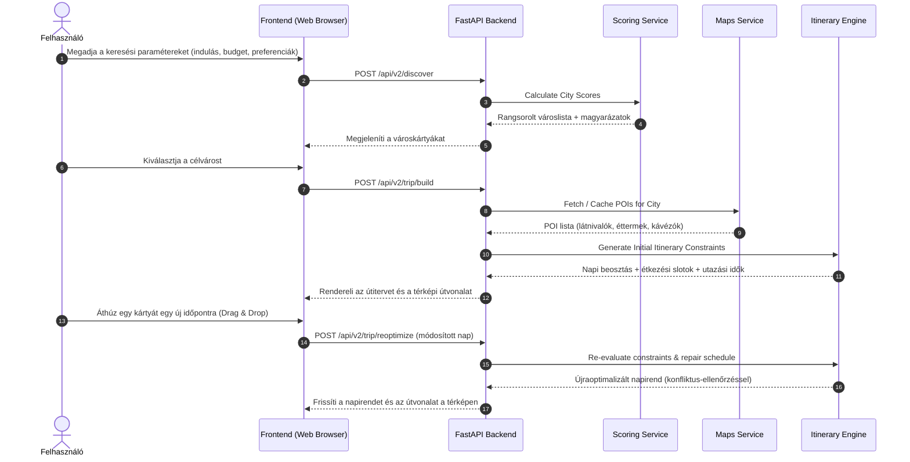

# DreamTrip — Technikai Architektúra & Működési Logika

Ez a dokumentum írja le a **DreamTrip** rendszer felépítését, komponenseit, interakcióit és a teljes működési logikát.

---

## 1. Rendszerarchitektúra Áttekintés

A rendszer 4 moduláris rétegből áll:

1. **Destination Intelligence Layer**: Városok adatainak lekérdezése, aggregálása és pontozása (Kiwi, Open-Meteo, Numbeo, Walkability).
2. **POI Intelligence Layer**: Helyszínek (Point of Interest) kinyerése a Google Places API-ból, kategorizálás és helyi gyorsítótárazás.
3. **Trip Planning Engine**: Korlát-alapú (constraint-based) napi útiterv generálás, étkezési slotok és utazási idők kalkulációja.
4. **Optimization & Replanning Engine**: Helyi újraoptimalizálás a felhasználói szerkesztések (Drag & Drop) után, a lelakatolt elemek megőrzésével.

---

## 2. Mermaid Rendszerdiagramok

### 2.1 Rendszerösszetevők és Adatáramlás (`graph TD`)

```mermaid
graph TD
    subgraph Client Layer
        UI_Disc[Városválasztó Dashboard / Discover]
        UI_Plan[Útiterv Tervező Dashboard / Planner]
        Leaflet[Leaflet.js Interaktív Térkép]
    end

    subgraph FastAPI Application (app/)
        Router[API Endpoints & Controllers]
        Scoring[Scoring Service / Városrangsoroló]
        Itinerary[Itinerary Service / Napi Útiterv Engine]
        Maps[Maps Service / POI Kezelő]
    end

    subgraph Data & Scraper Layer
        Cache[POI JSON Cache / poi_cache.json]
        ScraperKiwi[Kiwi GraphQL Scraper]
        ScraperStays[Cozycozy Playwright Scraper]
    end

    subgraph External APIs
        KiwiAPI[Kiwi Flight API]
        GoogleAPI[Google Places API]
        MeteoAPI[Open-Meteo Weather API]
        NumbeoData[Numbeo Cost & Safety Data]
    end

    UI_Disc -->|POST /api/v2/discover| Router
    UI_Plan -->|POST /api/v2/trip/reoptimize| Router
    
    Router --> Scoring
    Router --> Itinerary
    
    Scoring --> ScraperKiwi
    ScraperKiwi --> KiwiAPI
    Scoring --> MeteoAPI
    Scoring --> NumbeoData
    
    Itinerary --> Maps
    Maps --> Cache
    Maps --> GoogleAPI
    
    Router --> ScraperStays
    
    UI_Plan <--> Leaflet
```

---

### 2.2 Utazástervezési és Szerkesztési Szekvencia (`sequenceDiagram`)



---

## 3. Részletes App Működési Logika (Folyószöveges Cselekvések Láncolata)

### 3.1 Városfelfedezési és Rangsorolási Működési Folyamat (City Discovery & Ranking Flow)

1. **Paraméterek Bevétele**: A felhasználó megadja az indulási várost, az utazási hónapot, az utazás időtartamát, a napi költségkeretet és a személyes preferenciáit (pl. ideális hőmérséklet).
2. **Párhuzamos Adatgyűjtés Indítása**: A szerver pontozó modulja elindítja az adatkeresést a célvárosokra.
3. **Repjegyárak Lekérdezése**: A rendszer valós időben lekérdezi a Kiwi repjegykereső API-t az indulási pont és a célvárosok között. Ha a repjegy API válaszol, az árakat normalizált pontszámmá alakítja. Ha az API hibát ad vagy nem érhető el, a motor automatikusan kieső scenarióra vált, és a kieső repjegy-súlyt szétosztja a többi tényező között.
4. **Időjárási Adatok Kinyerése**: Az Open-Meteo időjárási adatbázisból lekéri a célváros földrajzi koordinátáira vonatkozó átlagos hőmérsékletet a megadott hónapban, majd kiszámítja az eltérést a felhasználó által elvárt ideális hőmérséklettől.
5. **Megélhetési és Biztonsági Indexek Beolvasása**: A rendszer a helyi Numbeo adatbázisból kikeresi a célváros megélhetési indexét (melyet napi euró értékre vált át) és a közbiztonsági indexét.
6. **Gyalogos Bejárhatóság Kikeresése**: A statikus walkability adatbázisból kikeresi a város gyalogos bejárhatósági pontszámát.
7. **Pontszám Összegzés és Magyarázat**: A motor kiszámítja a 6 tényezőből álló súlyozott eredő pontszámot. Ezt követően minden városhoz egy közérthető, szöveges magyarázatot állít össze (például miért ez a város a legjobb választás a megadott szempontok alapján), majd az eredményt csökkenő sorrendben átadja a felületnek.

---

### 3.2 Helyszín (POI) Adatgyűjtési és Cache Kezelési Folyamat (POI Extraction & Cache Flow)

1. **Város Kiválasztása**: Amikor a felhasználó kiválasztja a célvárost, a rendszer elindítja a helyszínek (Point of Interest) összegyűjtését.
2. **Gyorsítótár Ellenőrzése**: A POI modul elsőként megvizsgálja a helyi lemezes JSON gyorsítótárat. Ha a gyorsítótárban megtalálható a város 7 napnál frissebb adatállománya, a szerver azonnal ebből tölti be a helyszíneket, megspórolva a külső API hívások költségét.
3. **Külső Google Places API Hívás**: Ha a gyorsítótár hiányzik vagy lejárt, és rendelkezésre áll érvényes Google Maps API kulcs, a rendszer földrajzi keresést indít a Google Places API felületén a város koordinátái körül.
4. **Kategorizálás és Adatkinyerés**: A letöltött helyszíneket kategóriákba sorolja (látnivalók, múzeumok, parkok, éttermek, kávézók, nézőpontok), kinyerve azok nevét, értékelését, pontos koordinátáit és részletes nyitvatartási idejét.
5. **Gyorsítótár Frissítése**: A letöltött POI listát elmenti a helyi gyorsítótár fájlba.
6. **Tartalék Szimuláció (Mock Fallback)**: Ha nem áll rendelkezésre Google API kulcs, a rendszer a város középpontja köré szimulált, valósághű nyitvatartással rendelkező teszt-helyszíneket helyez el, hogy az alkalmazás API kulcs nélkül is teljes értékűen tesztelhető maradjon.

---

### 3.3 Napi Útiterv Generálási és Korlát-ellenőrzési Folyamat (Itinerary Generation & Constraint Flow)

1. **Napi Időablakok Kijelölése**: A tervező motor felállítja az utazás egyes napjainak idővonalát (például reggel 8:30-tól este 21:00-ig).
2. **Étkezési Slotok Automatizált Beillesztése**: A rendszer automatikusan kijelöli az étkezési idősávokat: egy reggelit a reggeli órákban, egy ebédet kora délután, és egy vacsorát este. Ezekbe a slotokba a földrajzilag legközelebbi, magas értékelésű kávézókat és éttermeket helyezi be.
3. **Látnivalók Elrendezése és Útvonalfüzér**: A fennmaradó szabad idősávokba a top értékelésű látnivalókat és múzeumokat rendezi be.
4. **Távolságok Kiszámítása**: A két egymást követő helyszín közötti földrajzi távolságot a Haversine képlettel számítja ki.
5. **Utazási Idők Kalkulációja**: 
   - Ha a két helyszín közötti távolság másfél kilométeren belüli, a rendszer sétálási módot választ (átlagosan 4.5 km/h sebességgel számolva).
   - Ha a távolság meghaladja a másfél kilométert, a rendszer tömegközlekedési vagy taxis utazási időt számol (20 km/h átlagsebességgel és 5 perc várakozási idővel).
6. **Nyitvatartási Idők Validációja**: A motor összeveti a tervezett látogatási időpontot a helyszín hivatalos nyitvatartási sávjaival.
7. **Ütközések Észlelése**: Ha egy helyszín a látogatás idején zárva tartana, vagy az utazási idő miatt átfedés keletkezne a programok között, a szerver ütközési figyelmeztetést állít be az adott elemre.

---

### 3.4 Szerkesztési és Re-optimalizálási Folyamat (Drag & Drop Re-optimization Flow)

1. **Felhasználói Módosítás**: A felhasználó a webes felületen megfog egy programkártyát és áthúzza azt egy másik időpontra vagy egy másik napra.
2. **Adatküldés a Szervernek**: A böngésző elküldi a módosított napirendet a szerver re-optimalizáló végpontjának.
3. **Lokális Újraszámolás**: A szerver tervező motorja kizárólag a módosítással érintett nap napirendjét számítja újra; a többi nap programját nem bántja.
4. **Zárolt Elemek Megőrzése**: A motor megvizsgálja a felhasználó által lelakatolt (locked) programokat, és azokat fix pontként kezelve a szabad elemeket igazítja köréjük (kapzsi helyreállítási stratégia).
5. **Utazási Idők és Étkezések Újraillesztése**: Újraszámolja a szomszédos helyszínek közötti utazási idősávokat, és szükség esetén áthelyezi a környező étkezési slotokat a legoptimálisabb időpontra.
6. **Újra-validálás és Visszajelzés**: A szerver újraellenőrzi a nyitvatartásokat és az utazási időket. Ha ütközést észlel, sárga vagy piros jelzéssel látja el a kártyát, majd a frissített napirendet visszaküldi a felületnek.
7. **Térkép Frissítése**: A frontend azonnal frissíti a kártyák sorrendjét, és a Leaflet térképen újrarajzolja a sorszámozott jelölőket és az összekötő útvonalat.
