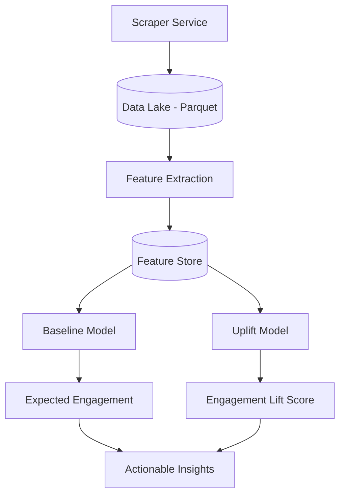

# Technical Project Plan: Social Media Engagement Prediction System

## 1. Executive Summary
This document outlines a robust, scalable, and cost-efficient machine learning system designed to predict **Engagement Lift** for social media posts. The system decomposes engagement into a baseline expected value (Context) and a relative performance boost (Content). By leveraging pre-trained open-source models and publicly scraped data, it provides an account-scale invariant and explainable approach to performance prediction.

---

## 2. High-Level System Architecture
The system follows a modular, decoupled architecture consisting of four main layers:

1.  **Ingestion Layer**: Handles scraping of public business accounts.
2.  **Featurization Layer**: Extracts multimodal features using frozen pre-trained encoders.
3.  **Modeling Layer**: Dual-model approach separating Context from Content performance.
4.  **Explanation Layer**: Provides SHAP-based attribution for structured features and similarity-based reasoning for embeddings.

---

## 3. Data Pipeline & Ingestion
### 3.1 Scraping Flow
*   **Target**: Public business accounts on Instagram (via Python scraping).
*   **Strategy**: Periodic polling of profile metadata and post history.
*   **Rate Limiting**: Implementation of jittered delays and session rotation to avoid bans.
*   **Media Handling**: Download images/thumbnails to local cache; delete post-featurization if storage is constrained.

### 3.2 Feature Extraction Pipeline
*   **Async Processing**: Use worker queues (e.g., Celery or simple multiprocessing) to process images and text independently.
*   **Caching Strategy**: Compute embeddings once per unique post ID and store in the Feature Store.
*   **Versioning**: DVC (Data Version Control) for tracking dataset and model artifacts.

### 3.3 Storage
*   **Data Lake**: Raw JSON and image files stored in categorized folder structures.
*   **Structured Data**: Parquet files utilized for high-throughput training/analysis.

---

## 4. Feature Architecture
### A) Context / Baseline Features
*   **Account Level**: `follower_count` (log-scaled), `post_count`, `biography_embedding`.
*   **Historical**: rolling average engagement (7d, 30d, 90d), posting frequency.
*   **Temporal**: `hour_of_day` (sin/cos encoding), `day_of_week`, `is_holiday`.
*   **Metadata**: `is_carousel`, `is_video`, `is_reel`.

### B) Textual Features (Pre-trained)
*   **Embeddings**: `all-MiniLM-L6-v2` (SBERT) for caption and hashtag semantics.
*   **Linguistic**: Sentiment score (VADER/TextBlob), readability index, word count.
*   **Rule-based**: CTA detection (e.g., "link in bio", "comment below"), question counts, emoji density.

### C) Visual Features (Pre-trained)
*   **Semantic**: CLIP (ViT-B/32) or MobileNetV3 image embeddings for general scene understanding.
*   **Compositional**: Brightness, contrast, color variance, edge density (clutter).
*   **Semantic Objects**: Face detection count and area ratio, OCR text presence/count.

---

## 5. Modeling Strategy
The system predicts **Engagement Lift** to avoid predicting absolute counts, which are dominated by follower size.

### Stage 1: Baseline Model (The "Expected" Value)
*   **Goal**: Predict the "natural" engagement for an account at a specific time.
*   **Inputs**: Context features ONLY.
*   **Algorithm**: LightGBM or XGBoost (Regressor).
*   **TargetVar**: `log(engagement + 1)`

### Stage 2: Uplift Model (The "Content" Value)
*   **Goal**: Predict the deviation from the baseline.
*   **Inputs**: Context + Text + Visual embeddings.
*   **Algorithm**: Gradient Boosted Trees (capable of handling high-dimensional embeddings via PCA or direct integration).
*   **TargetVar**: `(actual - baseline) / baseline` (Lift %).

### Explainability
*   **Structured Features**: SHAP values to quantify the impact of things like "face count" or "posting hour."
*   **Embeddings**: Nearest Neighbor display (showing similar historical posts that performed well).

---

## 6. Feature Store Design
A unified schema ensuring consistency between offline training and online inference.

| Field | Type | Storage | Source |
| :--- | :--- | :--- | :--- |
| `post_id` | STRING (PK) | Parquet/SQL | Metadata |
| `account_id` | STRING | Parquet/SQL | Metadata |
| `timestamp` | DATETIME | Parquet/SQL | Metadata |
| `context_vec` | FLOAT[] | Vector Store/BLOB | Context Engine |
| `text_embed` | FLOAT[384] | Vector Store/BLOB | SBERT |
| `visual_embed` | FLOAT[512] | Vector Store/BLOB | CLIP |
| `actual_eng` | INT | Parquet/SQL | Scraper |

---

## 7. Evaluation Metrics
### 7.1 Regression Metrics
*   **MAE (Mean Absolute Error)**: Average deviation of Lift %.
*   **MAPE (Mean Absolute Percentage Error)**: Useful for comparing across different niches.
*   **Correlation (Spearman)**: Rank correlation between predicted lift and actual lift.

### 7.2 Performance Robustness
*   **Niche Stability**: Evaluation of error variance across different niches (Fitness vs. Tech vs. Fashion).
*   **Scale Invariance**: Ensuring model error does not correlate with `follower_count`.

---

## 8. MVP Scope & Roadmap
### Phase 1 (MVP)
*   Static image support only.
*   Instagram "Business" account scraper.
*   Feature extraction: Context + SBERT + CLIP.
*   Baseline + Uplift models (LightGBM).

### Phase 2 (Extensions)
*   **Video/Reels Support**: Video frame sampling (keyframe analysis) and audio sentiment.
*   **Trends Integration**: Hashtag momentum as a baseline feature.
*   **Active Learning**: Human-in-the-loop labeling for CTA quality.

---

## 9. Risks and Mitigations
| Risk | Mitigation Strategy |
| :--- | :--- |
| **Scraping Instability** | Modular scraper with fallback proxies and user-agent rotation. |
| **Cold Start** | Initialize new accounts with "Niche Average" features until history is built. |
| **Explainability Gap** | Use SHAP for global feature importance and LIME for local post-explanation. |
| **Data Noise** | Remove bot-heavy outliers using engagement-to-follower ratio sanity checks. |
