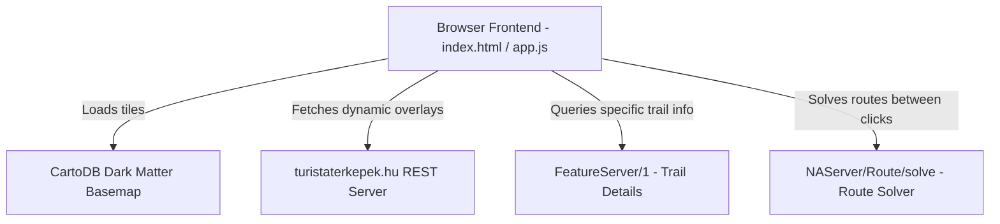

# ARCHITECTURE - TuristaÚt Kalandtervező

## Architecture Overview
The application runs entirely in the client browser, directly communicating with external services for map tiles and routing calculation.

## Core Modules
- **UI Layout**: Responsive layout with a full-screen Leaflet map canvas and a glassmorphic floating control panel.
- **ArcGIS Query Manager**: Submodule within `app.js` that constructs raw query URLs for searching paths by attributes (e.g. `where=signs LIKE '%K%'`) or spatial extent.
- **Routing Engine**: Handles the list of stops clicked on the map, formats them as ArcGIS Stop JSON objects, calls the solve endpoint, and returns a detailed paths geojson.
- **GPX Exporter**: Reads the JSON track coordinates and output metrics (duration, distance, elevation) and formats them into a standard XML-based GPX schema.
